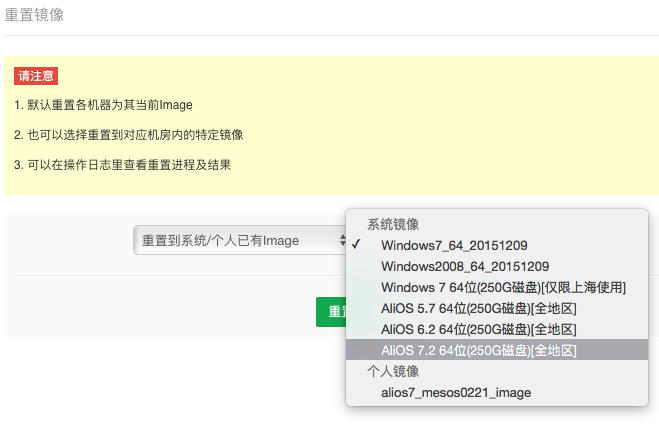
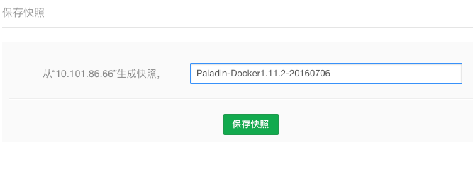
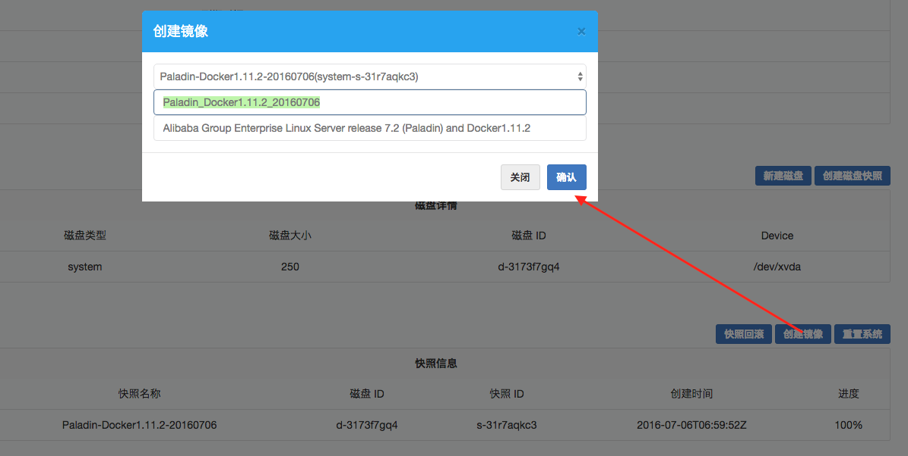

### 1 选择虚拟机->重置镜像
[天池·我的虚拟机](http://tianchi.alibaba-inc.com/tianchi/Dashboard/i_my_machines_vir)

http://tianchi.alibaba-inc.com/reservation/vm/1309




### 本地ssh免密
```sh
ssh-copy-id -i .ssh/id_rsa.pub lu.hl@10.101.86.66
ssh lu.hl@10.101.86.66
```

### 2 安装Docker
```sh
ssh lu.hl@10.101.86.66

$ sudo yum update

$uname -r
3.10.0-327.ali2000.alios7.x86_64

$cat /etc/redhat-release
Alibaba Group Enterprise Linux Server release 7.2 (Paladin)

$yum list installed | grep docker
docker.x86_64                   1.8.2-10.alios7                        @anaconda
docker-selinux.x86_64           1.8.2-10.alios7                        @anaconda

$sudo yum -y remove docker.x86_64 docker-selinux.x86_64

$sudo tee /etc/yum.repos.d/docker.repo <<-'EOF'
[dockerrepo]
name=Docker Repository
baseurl=https://yum.dockerproject.org/repo/main/centos/7/
enabled=1
gpgcheck=1
gpgkey=https://yum.dockerproject.org/gpg
EOF

$sudo yum install -y docker-engine
```

```sh
$sudo route del -net 172.16.0.0 netmask 255.240.0.0

$sudo service docker start

$sudo docker version
Client:
 Version:      1.11.2
 API version:  1.23
 Go version:   go1.5.4
 Git commit:   b9f10c9
 Built:        Wed Jun  1 21:23:11 2016
 OS/Arch:      linux/amd64

Server:
 Version:      1.11.2
 API version:  1.23
 Go version:   go1.5.4
 Git commit:   b9f10c9
 Built:        Wed Jun  1 21:23:11 2016
 OS/Arch:      linux/amd64

$sudo usermod -aG docker lu.hl

$sudo chkconfig docker on
Note: Forwarding request to 'systemctl enable docker.service'.
Created symlink from /etc/systemd/system/multi-user.target.wants/docker.service to /usr/lib/systemd/system/docker.service.

$sudo reboot
```

httpie
```sh
sudo yum -y install python-pip
sudo pip install --upgrade https://github.com/jkbrzt/httpie/archive/master.tar.gz
```

### 3 选择虚拟机->保存快照

[天池·我的虚拟机](http://tianchi.alibaba-inc.com/tianchi/Dashboard/i_my_machines_vir)


- **Paladin-Docker1.12.3-20161130**
- Paladin-Docker1.11.2-20160706

### 4 创建镜像
[KFC·资源管理·服务器](http://kfc.alibaba-inc.com/#/resource/manage/server)

输入`10.101.86.66`并查询，点击列表中的SN名称(本例为i-31oprfw6f)进入http://kfc.alibaba-inc.com/#/resource/manage/server/i-31oprfw6f



**Paladin_Docker1.11.2_20160706**

Alibaba Group Enterprise Linux Server release 7.2 (Paladin) and Docker1.11.2

### 5 查看镜像
[KFC·镜像管理·自定义镜像](http://kfc.alibaba-inc.com/#/resource/image/personimage)

### 6 批量重置镜像
同步骤1


## 2017.3.22 升级内核

http://mirrors.163.com/.help/centos.html

https://www.atatech.org/articles/34442