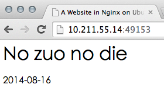

搭建Nginx服务器
----

###1 Docker-Ubuntu-Nginx
>工作目录：/home/erichan/docker-room/ubuntu-nginx

###2 制作镜像
```
[erichan@mars-centos7 ubuntu-nginx]$ nano Dockerfile
# Version: 0.0.1
FROM feuyeux/ubuntu-base
MAINTAINER Eric Han "feuyeux@gmail.com"
RUN apt-get update
RUN apt-get -yq install nginx
RUN mkdir -p /var/www/html
ADD nginx/global.conf /etc/nginx/conf.d/
ADD nginx/nginx.conf /etc/nginx/nginx.conf
EXPOSE 80
```

###3 nginx配置文件
**nginx/global.conf**

```
[erichan@mars-centos7 ubuntu-nginx]$ mkdir nginx && nano nginx/global.conf
 
server {
        listen          0.0.0.0:80;
server_name     _;
root            /var/www/html/website;
index           index.html index.htm;
access_log /var/log/nginx/default_access.log;
error_log /var/log/nginx/default_error.log;
}

```

**nginx/nginx.conf**

```
[erichan@mars-centos7 ubuntu-nginx]$ nano nginx/nginx.conf
user www-data;
worker_processes 4;
pid /run/nginx.pid;
daemon off;
events { }
http {
  sendfile on;
  tcp_nopush on;
  tcp_nodelay on;
  keepalive_timeout 65;
  types_hash_max_size 2048;
  include /etc/nginx/mime.types;
  default_type application/octet-stream;
  access_log /var/log/nginx/access.log;
  error_log /var/log/nginx/error.log;
  gzip on;
  gzip_disable "msie6";
  include /etc/nginx/conf.d/*.conf;
}
```

###4 测试页面	
```
[erichan@mars-centos7 ubuntu-nginx]$ mkdir website && nano website/index.html
<head>
  <title>Test website</title>
</head>
<body>
  <h1>This is a test website</h1>
  <p>learning The docker book.</p>
</body>
```

###5 构建镜像
>start time = 2014年 8月16日 星期六 20时44分38秒 CST; end time  = 2014年 8月16日 星期六 20时51分04秒 CST

```
[erichan@mars-centos7 ubuntu-nginx]$ d build -t="feuyeux/nginx:1.0" .
```

###6 校验镜像
```
[erichan@mars-centos7 ubuntu-nginx]$ d images
REPOSITORY            TAG                 IMAGE ID            CREATED              VIRTUAL SIZE
feuyeux/nginx         1.0                 7f1df0dc6e46        About a minute ago   291.6 MB
feuyeux/ubuntu-base   latest              30fe631d9934        31 minutes ago       274.9 MB
ubuntu                14.04               c4ff7513909d        4 days ago           213 MB
```

###7 启动nginx服务器
```
PWD=/home/erichan/docker-room/ubuntu-nginx/website
d run -d -p 80 --name website -v $PWD:/var/www/html/website feuyeux/nginx:1.0 nginx
```
>**$PWD:/var/www/html/website**

###8 查看nginx进程
```
[erichan@mars-centos7 website]$ d ps -l
CONTAINER ID        IMAGE               COMMAND             CREATED             STATUS              PORTS                           NAMES
f1b77616d1f5        feuyeux/nginx:1.0   nginx               16 seconds ago      Up 15 seconds       22/tcp, 0.0.0.0:49153->80/tcp   website    
```

###9 测试Nginx
```
[erichan@mars-centos7 website]$ curl http://localhost:49153
```

####备用命令
```
d run -ti feuyeux/nginx:1.0 /bin/bash
d run -ti feuyeux/nginx:1.0 ls /var/www/html/website
```

###10 修改本地文件
```
[erichan@mars-centos7 website]$ nano $PWD/index.html
<head>
  <title>A Website in Nginx on Ubuntu14.04 running on Docker1.1.2</title>
</head>
<body>
  <h1>No zuo no die</h1>
  <p>2014-08-16</p>
</body>
```

###11 测试Docker·Nginx
```
[erichan@mars-centos7 website]$ curl -i http://localhost:49153
HTTP/1.1 200 OK
Server: nginx/1.4.6 (Ubuntu)
Date: Sat, 16 Aug 2014 14:44:00 GMT
Content-Type: text/html
Content-Length: 149
Last-Modified: Sat, 16 Aug 2014 14:42:39 GMT
Connection: keep-alive
ETag: "53ef6ddf-95"
Accept-Ranges: bytes

<head>
  <title>A Website in Nginx on Ubuntu14.04 running on Docker1.1.2</title>
</head>
<body>
  <h1>No zuo no die</h1>
  <p>2014-08-16</p>
</body>
```



###12 停止进程并删除容器（不是删除镜像）
```
d rm $(d ps -a -q)
d kill $(d ps -q) && d rm $(d ps -a -q)
```


[返回主页面](/README.md)