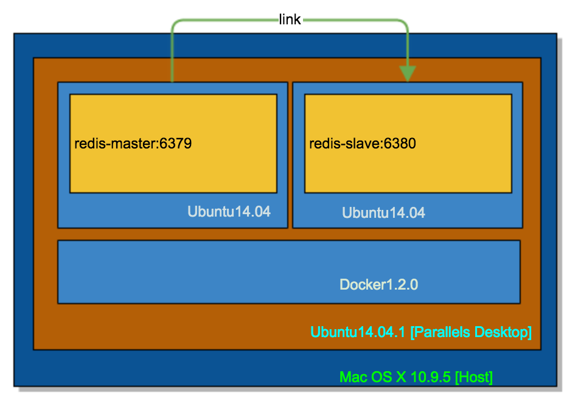

搭建Redis服务器
----



### 1 Docker-Ubuntu-Redis
>工作目录：/home/erichan/docker-room/ubuntu-redis

#### 1.1 制作镜像
```
erichan@ubuntu14_04_1-pd:~/docker-room/ubuntu-redis$ nano Dockerfile
```

```
# Version: 0.0.1
FROM feuyeux/ubuntu-base
MAINTAINER Eric Han "feuyeux@gmail.com"
RUN apt-get update && apt-get install -y wget gcc make g++ build-essential libc6-dev tcl git supervisor
RUN cd /tmp && wget -q http://download.redis.io/redis-stable.tar.gz
RUN tar -xzf /tmp/redis-stable.tar.gz -C /opt
RUN cd /opt/redis-stable && make && make install
RUN cp -f /opt/redis-stable/src/redis-sentinel /usr/local/bin
RUN mkdir -p /etc/redis && cp -f /opt/redis-stable/*.conf /etc/redis
RUN rm -rf /tmp/redis-stable*
RUN sed -i 's/^\(bind .*\)$/# \1/' /etc/redis/redis.conf && \
  sed -i 's/^\(daemonize .*\)$/# \1/' /etc/redis/redis.conf && \
  sed -i 's/^\(dir .*\)$/# \1\ndir \/data/' /etc/redis/redis.conf && \
  sed -i 's/^\(logfile .*\)$/# \1/' /etc/redis/redis.conf
VOLUME ["/data"]
WORKDIR /data
CMD ["redis-server", "/etc/redis/redis.conf"]
EXPOSE 6379
```

#### 1.2 创建镜像
```
erichan@ubuntu14_04_1-pd:~/docker-room/ubuntu-redis$ d build -t feuyeux/redis .
```

#### 1.3 测试镜像
```
erichan@ubuntu14_04_1-pd:~/docker-room/ubuntu-redis$ d run -d --name redis -p 6379:6379 feuyeux/redis
```

#####redis-cli
```
d run -ti --rm --link redis:redis feuyeux/redis bash -c 'redis-cli -h $REDIS_PORT_6379_TCP_ADDR'
```
>--rm=false: Automatically remove the container when it exits (incompatible with -d)

###2 Master-Slave Cluster
>工作目录：/home/erichan/docker-room/ubuntu-redis/slave

#### 2.1 制作镜像

```
# Version: 0.0.1
FROM feuyeux/redis
MAINTAINER Eric Han "feuyeux@gmail.com"
VOLUME ["/data"]
#RUN sysctl vm.overcommit_memory=1
ADD slave.sh /opt/redis-slave.sh
RUN chmod a+x /opt/redis-slave.sh
RUN sed 's/port 6379/port 6380/' /etc/redis/redis.conf
ENTRYPOINT ["/opt/redis-slave.sh", "--dir", "/data"]
EXPOSE 6380
```
>mac: ```sed -ig 's/port 6379/port 6380/' redis.conf```

##### start-slave.sh

```
#!/bin/bash
echo "master = $REDIS_MASTER_PORT_6379_TCP_ADDR"
if [ -z "$REDIS_MASTER_PORT_6379_TCP_ADDR" ]; then
    echo "REDIS_MASTER_PORT_6379_TCP_ADDR not defined. Did you run with -link?";
    exit 7;
fi
exec redis-server --slaveof $REDIS_MASTER_PORT_6379_TCP_ADDR $REDIS_MASTER_PORT_6379_TCP_PORT $*
```

#### 2.2 创建镜像

```
erichan@ubuntu14_04_1-pd:~/docker-room/ubuntu-redis/slave$ d build -t feuyeux/redis-slave .
```

#### 2.3 测试镜像

#####启动主

```
Master:
d run -d --name=feuyeux_redis_master -p 6379:6379 feuyeux/redis
```

#####检测主
```
d run -ti --rm --name redis-cli --link feuyeux_redis_master:redis_master feuyeux/redis /bin/bash
root@4096c03f37bc:/data# env
HOSTNAME=4096c03f37bc
TERM=xterm
REDIS_MASTER_PORT_22_TCP_PROTO=tcp
REDIS_MASTER_NAME=/redis-cli/redis_master
REDIS_MASTER_PORT_6379_TCP_ADDR=172.17.0.2
REDIS_MASTER_PORT_22_TCP=tcp://172.17.0.2:22
REDIS_MASTER_PORT_6379_TCP=tcp://172.17.0.2:6379
PATH=/usr/local/sbin:/usr/local/bin:/usr/sbin:/usr/bin:/sbin:/bin
PWD=/data
REDIS_MASTER_PORT_22_TCP_PORT=22
SHLVL=1
HOME=/
REDIS_MASTER_PORT_22_TCP_ADDR=172.17.0.2
REDIS_MASTER_PORT_6379_TCP_PORT=6379
REDIS_MASTER_PORT_6379_TCP_PROTO=tcp
REDIS_MASTER_PORT=tcp://172.17.0.2:22
_=/usr/bin/env
root@4096c03f37bc:/data# 
```

#####启动辅
```
Slave:
d run -d --name=feuyeux_redis_slave -p 6379:6380 --link=feuyeux_redis_master:redis_master feuyeux/redis-slave
```

>调试

```
d kill $(d ps -a) && d rm $(d ps -a -q)

d build -t feuyeux/redis-slave . && 
d run -d --name feuyeux_redis_master -p 6379:6379 feuyeux/redis && d run -d --name=feuyeux_redis_slave -p 6380:6380 --link=feuyeux_redis_master:redis_master feuyeux/redis-slave && d logs feuyeux_redis_slave

d start feuyeux_redis_slave
d start feuyeux_redis_master
```

#####redis-cli

#####进入主/辅
```
Cli-Master:
PID=$(d inspect --format {{.State.Pid}} feuyeux_redis_master) && sudo nsenter --target $PID --mount --uts --ipc --net --pid

Cli-Slave:
PID=$(d inspect --format {{.State.Pid}} feuyeux_redis_slave) && sudo nsenter --target $PID --mount --uts --ipc --net --pid
```

On Master

```
root@5f1efcd13f97:/# redis-cli
127.0.0.1:6379> keys *
(empty list or set)
127.0.0.1:6379> set lastName Han
OK
127.0.0.1:6379> set firstName Eric
OK
127.0.0.1:6379> set middleName Lu
OK
127.0.0.1:6379> keys *
1) "middleName"
2) "lastName"
3) "firstName"
```
On Slave

```
root@41d478df16f1:/# redis-cli -p 6380
127.0.0.1:6380> keys *
(empty list or set)
127.0.0.1:6380> keys *
1) "firstName"
2) "lastName"
3) "middleName"
```

On Host-Host(Mac OS)

```
[erichan@Eric-Mavericks ~]$ nc 192.168.1.12 6380
get lastName
$3
Han
quit
+OK
[erichan@Eric-Mavericks ~]$ 
```
>192.168.1.12 is Docker Host(Ubuntu) IP

(完)

>参考

- [running_redis_service](https://docs.docker.com/examples/running_redis_service)
- [dockerfile/redis](https://github.com/dockerfile/redis)
- [james-m](https://gist.github.com/james-m/8700237)
