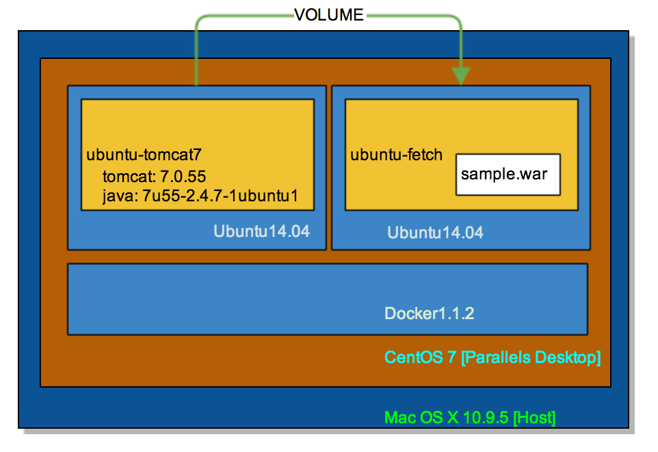
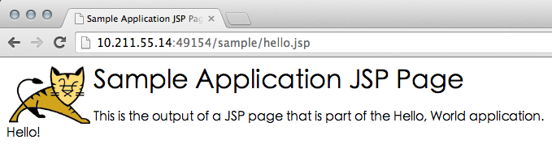

搭建Tomcat服务器
----
###0 tomcat应用·盗梦空间


### 1 Docker-Ubuntu-Java7
>工作目录：/home/erichan/docker-room/ubuntu-java7

#### 1.1 制作镜像
```
[erichan@mars-centos7 ubuntu-java7]$ nano Dockerfile
```

```
# Version: 0.0.1
FROM feuyeux/ubuntu-base
MAINTAINER Eric Han "feuyeux@gmail.com"
ENV REFRESHED_AT 2014-08-18
RUN (echo "deb http://archive.ubuntu.com/ubuntu/ trusty main restricted universe multiverse" > /etc/apt/sources.list && echo "deb http://archive.ubuntu.com/ubuntu/ trusty-security main restricted universe multiverse" >> /etc/apt/sources.list && echo "deb http://archive.u$
RUN apt-get update
RUN DEBIAN_FRONTEND=noninteractive apt-get install -y openjdk-7-jre-headless
RUN apt-get clean
RUN update-alternatives --display java
RUN echo "JAVA_HOME=/usr/lib/jvm/java-7-openjdk-amd64" >> /etc/environment
```

#### 1.2 创建镜像
```
d build -t feuyeux/ubuntu-java7 .
```

#### 1.3 测试镜像
```
[erichan@mars-centos7 ubuntu-java7]$ d run -ti feuyeux/ubuntu-java7 java -version
java version "1.7.0_55"
OpenJDK Runtime Environment (IcedTea 2.4.7) (7u55-2.4.7-1ubuntu1)
OpenJDK 64-Bit Server VM (build 24.51-b03, mixed mode)
```

###2 Docker-Ubuntu-Tomcat7
>工作目录：/home/erichan/docker-room/ubuntu-tomcat

####2.1 创建Tomcat设置脚本
```
[erichan@mars-centos7 ubuntu-tomcat]$ nano settom.sh
```

```
#!/bin/bash
ADMIN_USER=${ADMIN_USER:-admin}
ADMIN_PASS=${ADMIN_PASS:-tomcat}
MAX_UPLOAD_SIZE=${MAX_UPLOAD_SIZE:-52428800}
CATALINA_OPTS=${CATALINA_OPTS:-"-Xms128m -Xmx1024m -XX:PermSize=128m -XX:MaxPermSize=256m"}
export CATALINA_OPTS="${CATALINA_OPTS}"

cat << EOF > /opt/tomcat/conf/tomcat-users.xml
<?xml version='1.0' encoding='utf-8'?>
<tomcat-users>
<user username="${ADMIN_USER}" password="${ADMIN_PASS}" roles="admin-gui,manager-gui"/>
</tomcat-users>
EOF

if [ -f "/opt/tomcat/webapps/manager/WEB-INF/web.xml" ]
then
	sed -i "s#.*max-file-size.*#\t<max-file-size>${MAX_UPLOAD_SIZE}</max-file-size>#g" /opt/tomcat/webapps/manager/WEB-INF/web.xml
	sed -i "s#.*max-request-size.*#\t<max-request-size>${MAX_UPLOAD_SIZE}</max-request-size>#g" /opt/tomcat/webapps/manager/WEB-INF/web.xml
fi
/bin/sh -e /opt/tomcat/bin/catalina.sh run
```

#### 2.2 制作镜像

```[erichan@mars-centos7 ubuntu-tomcat]$ nano Dockerfile ```

```
# Version: 0.0.1
FROM feuyeux/ubuntu-java7
MAINTAINER Eric Han "feuyeux@gmail.com"
ENV REFRESHED_AT 2014-08-18
ENV TOMCATVER 7.0.55
RUN DEBIAN_FRONTEND=noninteractive apt-get install -y wget
RUN (wget -O /tmp/tomcat7.tar.gz http://apache.fayea.com/apache-mirror/tomcat/tomcat-7/v${TOMCATVER}/bin/apache-tomcat-${TOMCATVER}.tar.gz && \
	cd /opt && \
	tar zxf /tmp/tomcat7.tar.gz && \
	mv /opt/apache-tomcat* /opt/tomcat && \
	rm /tmp/tomcat7.tar.gz)
ADD ./settom.sh /usr/local/bin/run
EXPOSE 8080
CMD ["/bin/sh", "-e", "/usr/local/bin/run"]
```

#### 2.3 创建镜像
```
d build -t feuyeux/ubuntu-tomcat7 .
```

#### 2.4 测试镜像
```
[erichan@mars-centos7 ubuntu-tomcat]$ d run -ti feuyeux/ubuntu-tomcat7 java -version
java version "1.7.0_55"
OpenJDK Runtime Environment (IcedTea 2.4.7) (7u55-2.4.7-1ubuntu1)
OpenJDK 64-Bit Server VM (build 24.51-b03, mixed mode)

[erichan@mars-centos7 ubuntu-tomcat]$ d run -ti feuyeux/ubuntu-tomcat7 cat /etc/environment
PATH="/usr/local/sbin:/usr/local/bin:/usr/sbin:/usr/bin:/sbin:/bin:/usr/games:/usr/local/games"
JAVA_HOME=/usr/lib/jvm/java-7-openjdk-amd64

```

```
[erichan@mars-centos7 ubuntu-tomcat]$ d run -p 8080:8080 -d feuyeux/ubuntu-tomcat7
[erichan@mars-centos7 ~]$ curl --user admin:tomcat http://localhost:8080/manager/html -i | grep HTTP
  % Total    % Received % Xferd  Average Speed   Time    Time     Time  Current
                                 Dload  Upload   Total   Spent    Left  Speed
100 17023    0 17023    0     0  95321      0 --:--:-- --:--:-- --:--:-- 96175
HTTP/1.1 200 OK
```

###3 Docker-Ubuntu-Fetch
>工作目录：/home/erichan/docker-room/ubuntu-fetch


#### 3.1 制作镜像

```[erichan@mars-centos7 ubuntu-fetch]$ nano Dockerfile ```

```
# Version: 0.0.1
FROM feuyeux/ubuntu-base
MAINTAINER Eric Han "feuyeux@gmail.com"
ENV REFRESHED_AT 2014-08-18
RUN apt-get -yqq update
RUN apt-get -yqq install wget
VOLUME [ "/opt/tomcat/webapps/" ]
WORKDIR /opt/tomcat/webapps/
ENTRYPOINT [ "wget" ]
CMD [ "-?" ]
```

#### 3.2 创建镜像
```
d build -t feuyeux/tomcat-webapp .
```

#### 3.3 加载war
```
[erichan@mars-centos7 ubuntu-fetch]$ d run -ti --name fetch-app feuyeux/tomcat-webapp http://tomcat.apache.org/tomcat-8.0-doc/appdev/sample/sample.war
```

###4 引入卷(volumes)
```
[erichan@mars-centos7 ubuntu-fetch]$ d run --name tom-app --volumes-from fetch-app -d -P feuyeux/ubuntu-tomcat7
```
```
[erichan@mars-centos7 ubuntu-fetch]$ d port tom-app 8080
0.0.0.0:49154
```



[返回主页面](/README.md)