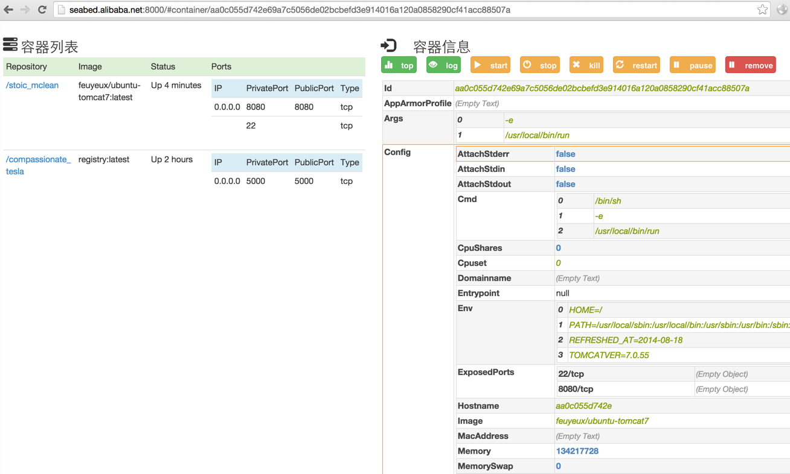

本文的目的是测试Docker对容器内存资源的限制。启动一个容器，为其设置最大128m的内存

```
d run -d -p 8080:8080 -m="128m" --cpuset="0" feuyeux/ubuntu-tomcat7
```

通过[seabed](http://seabed.alibaba.net)查看容器状态



访问http://10.101.72.17:8080/ （10.101.72.17是Docker Host的IP），以测试该容器的内存使用情况（该容器内的tomcat最小堆大小是128m，最大是1024m）。访问的瞬间该容器退出：ExitCode=137.

获取该容器的进程ID，重启该容器并进入容器

```
d start aa0c055d742e
d exec -ti aa0c055d742e bash
```

在容器内查询上次崩掉的日志

```
root@aa0c055d742e:/var/log# dmesg

[16277.381314] java invoked oom-killer: gfp_mask=0xd0, order=0, oom_score_adj=0
[16277.381320] java cpuset=aa0c055d742e69a7c5056de02bcbefd3e914016a120a0858290cf41acc88507a mems_allowed=0
[16277.381324] CPU: 0 PID: 7536 Comm: java Not tainted 3.13.0-44-generic #73-Ubuntu
[16277.381326] Hardware name: Inventec     K600-1G                         /B600G2-1G       , BIOS A1.08 02/17/2014
[16277.381328]  ffff881700834c00 ffff8817807bdc48 ffffffff81720d86 ffff8817f7f91800
[16277.381334]  ffff8817807bdcd0 ffffffff8171b641 0000000000000202 0000000000000006
[16277.381337]  0000000000000046 ffff8817807bdca0 ffffffff811522c7 ffff8817f7071780
[16277.381341] Call Trace:
[16277.381360]  [<ffffffff81720d86>] dump_stack+0x45/0x56
[16277.381365]  [<ffffffff8171b641>] dump_header+0x7f/0x1f1
[16277.381370]  [<ffffffff811522c7>] ? find_lock_task_mm+0x27/0x70
[16277.381372]  [<ffffffff811526fe>] oom_kill_process+0x1ce/0x330
[16277.381378]  [<ffffffff812d6cd5>] ? security_capable_noaudit+0x15/0x20
[16277.381385]  [<ffffffff811b490c>] mem_cgroup_oom_synchronize+0x51c/0x560
[16277.381389]  [<ffffffff811b3e40>] ? mem_cgroup_charge_common+0xa0/0xa0
[16277.381391]  [<ffffffff81152e84>] pagefault_out_of_memory+0x14/0x80
[16277.381394]  [<ffffffff81719c31>] mm_fault_error+0x8e/0x180
[16277.381399]  [<ffffffff8172d0f1>] __do_page_fault+0x4a1/0x560
[16277.381404]  [<ffffffff811bdb0e>] ? vfs_read+0xee/0x160
[16277.381407]  [<ffffffff8172d1ca>] do_page_fault+0x1a/0x70
[16277.381410]  [<ffffffff81729628>] page_fault+0x28/0x30
[16277.381414] Task in /docker/aa0c055d742e69a7c5056de02bcbefd3e914016a120a0858290cf41acc88507a killed as a result of limit of /docker/aa0c055d742e69a7c5056de02bcbefd3e914016a120a0858290cf41acc88507a
[16277.381417] memory: usage 131072kB, limit 131072kB, failcnt 1462
[16277.381419] memory+swap: usage 131072kB, limit 262144kB, failcnt 0
[16277.381420] kmem: usage 0kB, limit 18014398509481983kB, failcnt 0
[16277.381421] Memory cgroup stats for /docker/aa0c055d742e69a7c5056de02bcbefd3e914016a120a0858290cf41acc88507a: cache:68KB rss:131004KB rss_huge:90112KB mapped_file:0KB writeback:0KB swap:0KB inactive_anon:65708KB active_anon:65344KB inactive_file:12KB active_file:8KB unevictable:0KB
[16277.381445] [ pid ]   uid  tgid total_vm      rss nr_ptes swapents oom_score_adj name
[16277.381523] [ 7459]     0  7459     1111      163       7        0             0 sh
[16277.381525] [ 7493]     0  7493   988100    35660     206        0             0 java
[16277.381528] Memory cgroup out of memory: Kill process 7537 (java) score 1094 or sacrifice child
[16277.381583] Killed process 7537 (java) total-vm:3952400kB, anon-rss:129696kB, file-rss:12944kB
[16277.428936] docker0: port 2(veth337f9d3) entered disabled state
[16277.429508] device veth337f9d3 left promiscuous mode
[16277.429523] docker0: port 2(veth337f9d3) entered disabled state
```

从日志可以看到，TOMCAT请求更多内存时，出现了OOM，导致容器崩盘。

测试符合预期。

#### 附录·cgroup相关信息

获取容器ID完整名称

```
docker ps --no-trunc
CONTAINER ID                                                       IMAGE                           COMMAND                           CREATED             STATUS              PORTS                                  NAMES
853b4269c792e923a80b01dab109cc5c140db23d0fc588150c35d66b577080cf   feuyeux/ubuntu-tomcat7:latest   "/bin/sh -e /usr/local/bin/run"   32 seconds ago      Up 31 seconds       22/tcp, 0.0.0.0:8080->8080/tcp         happy_lovelace
```

查看内存状态

```
cat /sys/fs/cgroup/memory/docker/853b4269c792e923a80b01dab109cc5c140db23d0fc588150c35d66b577080cf/memory.stat
cache 33099776
rss 98385920
rss_huge 71303168
mapped_file 12300288
writeback 0
swap 0
pgpgin 35839
pgpgout 21112
pgfault 34768
pgmajfault 158
inactive_anon 6017024
active_anon 92393472
inactive_file 27648000
active_file 5398528
unevictable 0
hierarchical_memory_limit 134217728
hierarchical_memsw_limit 268435456
total_cache 33099776
total_rss 98385920
total_rss_huge 71303168
total_mapped_file 12300288
total_writeback 0
total_swap 0
total_pgpgin 35839
total_pgpgout 21112
total_pgfault 34768
total_pgmajfault 158
total_inactive_anon 6017024
total_active_anon 92393472
total_inactive_file 27648000
total_active_file 5398528
total_unevictable 0
```

查看CPU状态

```
cat /sys/fs/cgroup/cpu/docker/c5c4a8dc9901965bc1abd4f4c5a0df2e5aa720b26b7fa0d8efc201f527cc328e/cpu.stat
nr_periods 0
nr_throttled 0
throttled_time 0
```
