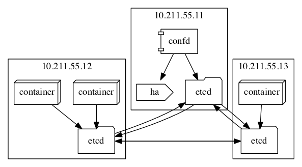

# etcd confd haproxy服务发现



## etcd
etcd用于服务发现的基础注册和通知，功能类似于zk，通过注册和监听，实现基础的服务发现。

### 安装
etcd安装非常简单，可以用go自己编译，etcd也提供了可以直接使用的二进制包（64位）。
具体的安装提示页面在[github](https://github.com/coreos/etcd/releases/)上，
直接按照上面的描述下载即可。为了方便，把里面的etcd相关的二进制文件（etcd, etcdctl等）
复制到了/usr/local/bin中，方便后续使用。

### 运行
首先尝试单机版启动，参照手册先直接启动，etcd默认监听的是localhost，既只监听了lo设备，
这样会导致启动后集群中的其他机器无法访问，因此在启动的时候将默认的localhost改成0.0.0.0，
确保etcd监听了所有网卡。
```bash
etcd -listen-client-urls "http://0.0.0.0:4001" -listen-peer-urls="http://0.0.0.0:7001"
```

启动之后可通过rest接口或者etcdctl执行命令：
``` bash
curl -L http://127.0.0.1:4001/version
```
输出结果为：
> {"releaseVersion":"2.0.0","internalVersion":"2"}

简单写入和读取：
```bash
curl -L http://127.0.0.1:4001/v2/keys/message -XPUT -d value="Hello world"
```
> {"action":"set","node":{"key":"/message","value":"Hello world","modifiedIndex":3,"createdIndex":3}}

```bash
curl -L http://127.0.0.1:4001/v2/keys/message
```
> {"action":"get","node":{"key":"/message","value":"Hello world","modifiedIndex":3,"createdIndex":3}}

### 集群启动
之前的启动方式为单机启动，集群创建官方给了很多种方式，这里尝试动态添加机器的方式。
```bash
etcd -name "node1" -initial-cluster "node1=http://10.211.55.11:2380" \
    -initial-advertise-peer-urls "http://10.211.55.11:2380" \
    -listen-client-urls "http://0.0.0.0:4001" \
    -listen-peer-urls="http://0.0.0.0:2380"
```
启动之后，通过member api，可以查看到当前集群：
```bash
curl -L http://10.211.55.11:4001/v2/members
```
> {"members":[{"id":"f0b31008acf03099","name":"node1","peerURLs":["http://10.211.55.11:2380","http://10.211.55.11:7001"],"clientURLs":["http://localhost:2379","http://localhost:4001"]}]}


向集群中添加一台机器：
```bash
etcdctl member add node2 http://10.211.55.12:2380
```
>Added member named node2 with ID 6d345c68496f80fc to cluster
>
>ETCD_NAME="node2"
>ETCD_INITIAL_CLUSTER="node2=http://10.211.55.12:2380,node1=http://10.211.55.11:2380,node1=http://10.211.55.11:7001"
>ETCD_INITIAL_CLUSTER_STATE="existing"

这里为了方便，没有只用rest接口，直接使用了etcdctl，该命令会提示在启动新的节点时所需要配置的环境变量。


启动新的节点：
```bash
export ETCD_NAME="node2"
export ETCD_INITIAL_CLUSTER="node1=http://10.211.55.11:2380,node2=http://10.211.55.12:2380"
export ETCD_INITIAL_CLUSTER_STATE="existing"
etcd -listen-client-urls http://0.0.0.0:4001 \
    -advertise-client-urls http://0.0.0.0:4001 \
    -listen-peer-urls http://10.211.55.12:2380 \
    -initial-advertise-peer-urls http://10.211.55.12:2380
```

启动之后，通过member接口查看当前集群机器：
```bash
etcdctl member list
```
>293ea5ba1d70f5f1: name=node2 peerURLs=http://10.211.55.12:2380 clientURLs=http://0.0.0.0:4001

>bd93686a68a54c2d: name=node1 peerURLs=http://10.211.55.11:2380 clientURLs=http://localhost:2379,http://localhost:4001

同样的方式再添加一台，成为基础的3台机器集群：
```bash
export ETCD_NAME="node3"
export ETCD_INITIAL_CLUSTER="node2=http://10.211.55.12:2380,node3=http://10.211.55.13:2380,node1=http://10.211.55.11:2380"
export ETCD_INITIAL_CLUSTER_STATE="existing"
etcd -listen-client-urls http://0.0.0.0:4001 \
    -advertise-client-urls http://0.0.0.0:4001 \
    -listen-peer-urls http://10.211.55.13:2380 \
    -initial-advertise-peer-urls http://10.211.55.13:2380
```

最终集群为:
>293ea5ba1d70f5f1: name=node2 peerURLs=http://10.211.55.12:2380 clientURLs=http://0.0.0.0:4001

>76610041ace6c4f8: name=node3 peerURLs=http://10.211.55.13:2380 clientURLs=http://0.0.0.0:4001

>bd93686a68a54c2d: name=node1 peerURLs=http://10.211.55.11:2380 clientURLs=http://localhost:2379,http://localhost:4001

在node1节点机器上运行：
```bash
etcdctl set /message hello
```
之后，在三台机器中执行：
```bash
etcdctl get /message
```
都能够正确的获取这个key的值：hello。

## confd
confd通过读取配置（支持etcd，consul，环境变量），通过go的模板，生成最终的配置文件。

### 安装
安装和etcd一样，非常方便，已经提供了64位的可执行程序，下载下来之后直接放到PATH中（/usr/local/bin）即可（别忘了+x）。

### haproxy配置生成
confd配置文件默认在/etc/confd中，可以通过参数-confdir指定。目录中包含两个子目录，分别是：conf.d  templates。
confd会先读取conf.d目录中的配置文件(toml格式)，然后根据文件指定的模板路径去渲染模板。

基于之前配置的etcd集群，读取/services/web中的目录和key。结构为：
```
/services/web/$DOMAIN/$HOST/ip
                          |-port
```
其中DOMAIN表示注册应用的域名，HOST表示注册机器的主机名。

首先创建confd配置文件：
```
[template]  
src = "haproxy.cfg.tmpl"  
dest = "/home/babydragon/haproxy/haproxy.cfg"  
keys = [  
"/services/web",  
]  
#reload_cmd = "/etc/init.d/haproxy reload"
```
现在只测试模板生成，所以不关注检查、重启等命令，配置模板名称、目标路径和获取的key即可。

着重看下模板变动部分（前面就是写死的一些haproxy的标准配置，如日志等）
```
frontend webin
bind :80

{{$domains := lsdir "/services/web"}}
{{range $domain := $domains}}
acl is_{{$domain}} hdr(host) -i {{$domain}}
{{end}}

{{range $domain := $domains}}
use_backend {{$domain}}_cluster if is_{{$domain}}
{{end}}

{{range $domain := $domains}}
backend {{$domain}}_cluster
cookie SERVERID insert indirect nocache
{{$domain_dir := printf "/services/web/%s" $domain}}{{range $host := lsdir $domain_dir}}
server {{base $host}} {{$ip_key := printf "/services/web/%s/%s/ip" $domain $host}}{{getv $ip_key}}:{{$port_key := printf "/services/web/%s/%s/port" $domain $host}}{{getv $port_key}} cookie {{base $host}} check
{{end}}
{{end}}
```
这里主要有两个循环，第一个循环所有的域名，第一个循环每一个域名下的所有主机。
haproxy需要通过设置acl的方式来进行按照域名做负载均衡。因此首先循环域名，为每个域名创建一个acl规则和一个规则的使用。
下面再通过一个循环，创建没个域名对应的后段。

confd模板详细文档可以参考[github上的文档](https://github.com/kelseyhightower/confd/blob/master/docs/templates.md)。
大致的意思是通过lsdir获取当前目录下的所有子目录。第一层子目录为域名，根据域名即可生成acl规则、规则使用、后端名称等数据。
再重新通过瓶装域名目录，对域名目录执行lsdir，读取目录下的每个主机名，创建后端的server条目（一个域名下的负载均衡后段服务器），
同时获取挂在这个目录下的属性键值对（这里只有ip和port）。

创建完模板和配置之后，先构造一些测试数据：
```
etcdctl mkdir /services/web
etcdctl mkdir /services/web/a.abc.com
etcdctl mkdir /services/web/b.abc.com
etcdctl mkdir /services/web/a.abc.com/server1
etcdctl mkdir /services/web/a.abc.com/server2
etcdctl mkdir /services/web/b.abc.com/server1
etcdctl set /services/web/a.abc.com/server1/ip 10.0.0.1
etcdctl set /services/web/a.abc.com/server1/port 10000
etcdctl set /services/web/a.abc.com/server2/port 10001
etcdctl set /services/web/a.abc.com/server2/ip 10.0.0.1
etcdctl set /services/web/b.abc.com/server1/ip 10.0.0.2
etcdctl set /services/web/b.abc.com/server1/port 12345
```
这里模拟三个容器，其中两个作为域名a.abc.com运行容器，一个作为b.abc.com容器。

然后执行confd，检查生成的配置文件：
```bash
confd -confdir ./confd -onetime -backend etcd -node 127.0.0.1:4001
```
刚才那段模板渲染后为：
```
frontend webin
    bind :80


    acl is_a.abc.com hdr(host) -i a.abc.com

    acl is_b.abc.com hdr(host) -i b.abc.com


    use_backend a.abc.com_cluster if is_a.abc.com

    use_backend b.abc.com_cluster if is_b.abc.com


backend a.abc.com_cluster
    cookie SERVERID insert indirect nocache

    server server1 10.0.0.1:10000 cookie server1 check

    server server2 10.0.0.1:10001 cookie server2 check


backend b.abc.com_cluster
    cookie SERVERID insert indirect nocache

    server server1 10.0.0.2:12345 cookie server1 check

```

## 最终测试
首先启动confd，按照前面的命令，去掉onetime参数，放到后台最为守护进程长期运行，确保etcd注册目录修改之后，能准实时生成haproxy的配置文件。

然后在两台slave，一台启动两个nginx容器，一台启动一台，模拟上面的a.abc.com和b.abc.com两个域名。

```bash
docker run -P -v `pwd`/html:/var/www/html -d dockerfile/nginx
```
这里暴露所有的端口（80和443），然后挂载当前的html目录给该容器，再html目录中创建一个1.html文件，
包含容器id、内部ip、外部ip作为测试。同样启动两个之后，通过master上的etcdctl配置这几个启动的容器：

```bash
etcdctl set /services/web/a.abc.com/server1/ip 10.211.55.12
etcdctl set /services/web/a.abc.com/server1/port 49154
etcdctl set /services/web/a.abc.com/server2/ip 10.211.55.12
etcdctl set /services/web/a.abc.com/server2/port 49156
etcdctl set /services/web/b.abc.com/server1/ip 10.211.55.13
etcdctl set /services/web/b.abc.com/server1/port 49154
```

confd会间歇性检查目录修改状态：
>INFO /home/babydragon/haproxy/haproxy.cfg has md5sum c8fb4ae9c10086b9f94cd11d0edecec1 should be 048c844d73c062014c0fd77d9548c47d

>2015-02-09T11:42:00+08:00 master confd[3781]: INFO Target config /home/babydragon/haproxy/haproxy.cfg out of sync

>2015-02-09T11:42:00+08:00 master confd[3781]: INFO Target config /home/babydragon/haproxy/haproxy.cfg has been updated

然后haproxy被更新：
```
acl is_a.abc.com hdr(host) -i a.abc.com

acl is_b.abc.com hdr(host) -i b.abc.com


use_backend a.abc.com_cluster if is_a.abc.com

use_backend b.abc.com_cluster if is_b.abc.com


backend a.abc.com_cluster
cookie SERVERID insert indirect nocache

server server1 10.211.55.12:49154 cookie server1 check

server server2 10.211.55.12:49156 cookie server2 check


backend b.abc.com_cluster
cookie SERVERID insert indirect nocache

server server1 10.211.55.13:49154 cookie server1 check
```

重新启动haproxy的容器（没有配置直接加载haproxy.cfg），查看status页面，两个backend都已经生效。通过curl模拟下：
```bash
curl -H "Host: a.abc.com" http://10.211.55.11:49154/1.html
```
> I am a80b37f78259 on 172.17.0.4 (Host: 10.211.55.12)
```bash
curl -H "Host: a.abc.com" http://10.211.55.11:49154/1.html
```
> I am 209b20bab7ce on 172.17.0.3 (Host: 10.211.55.12)

由于配置了负载均衡为轮询方式，两次请求被落到了不同的容器上，haproxy正确的将请求分发到了两个容器中。
