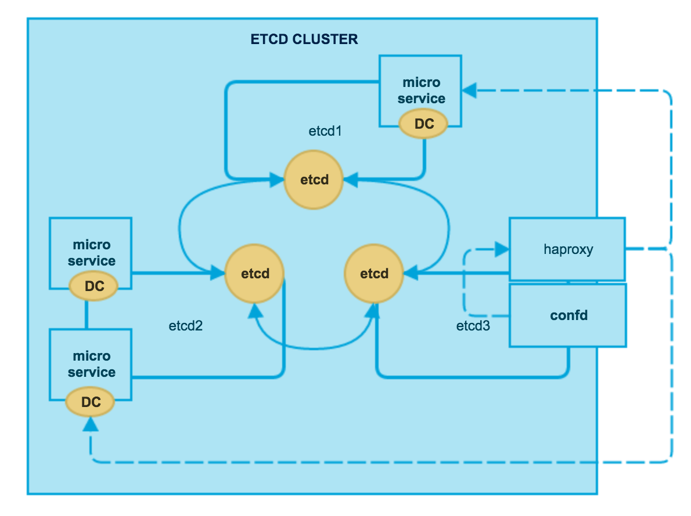

etcd confd haproxy服务发现
==========================


| IP           | Hostname | 服务               |
|:-------------|:---------|:-------------------|
| 10.211.55.23 | ectd1    | etcd docker        |
| 10.211.55.24 | ectd2    | etcd docker        |
| 10.211.55.25 | ectd3    | etcd confd haproxy |



1.etcd
------

### 1.1. 安装

```bash
curl -L  https://github.com/coreos/etcd/releases/download/v2.0.3/etcd-v2.0.3-linux-amd64.tar.gz -o etcd-v2.0.3-linux-amd64.tar.gz
tar xzvf etcd-v2.0.3-linux-amd64.tar.gz
cd etcd-v2.0.3-linux-amd64
./etcd

cp etcd /usr/local/bin
cp etcdctl /usr/local/bin
```

### 1.2. 单机测试

```bash
etcd -listen-client-urls "http://0.0.0.0:4001" -listen-peer-urls="http://0.0.0.0:7001"

curl -L http://127.0.0.1:4001/version

curl -L http://127.0.0.1:4001/v2/keys/x -XPUT -d value="9527"
curl -L http://127.0.0.1:4001/v2/keys/x
```

### 1.3. 静态集群

```bash
etcd -name infra0 \
  -initial-advertise-peer-urls http://10.211.55.23:2380 \
  -listen-peer-urls http://10.211.55.23:2380 \
  -listen-client-urls http://0.0.0.0:4001 \
  -initial-cluster-token etcd-cluster-1 \
  -initial-cluster infra0=http://10.211.55.23:2380,infra1=http://10.211.55.24:2380,infra2=http://10.211.55.25:2380 \
  -initial-cluster-state new

etcd -name infra1 -initial-advertise-peer-urls http://10.211.55.24:2380 \
  -listen-peer-urls http://10.211.55.24:2380 \
  -listen-client-urls http://0.0.0.0:4001 \
  -initial-cluster-token etcd-cluster-1 \
  -initial-cluster infra0=http://10.211.55.23:2380,infra1=http://10.211.55.24:2380,infra2=http://10.211.55.25:2380 \
  -initial-cluster-state new

etcd -name infra2 -initial-advertise-peer-urls http://10.211.55.25:2380 \
  -listen-peer-urls http://10.211.55.25:2380 \
  -listen-client-urls http://0.0.0.0:4001 \
  -initial-cluster-token etcd-cluster-1 \
  -initial-cluster infra0=http://10.211.55.23:2380,infra1=http://10.211.55.24:2380,infra2=http://10.211.55.25:2380 \
  -initial-cluster-state new

curl -L http://10.211.55.23:4001/v2/members | python -m json.tool
etcdctl member list
```

### 1.4 服务探测集群

```bash
etcd -name infra0 -initial-advertise-peer-urls http://10.211.55.23:2380 \
  -listen-peer-urls http://10.211.55.23:2380 \
  -discovery https://feuyeux/v2/keys/discovery/a2b0c1d5e0f2g2h3i0j0k0l2

etcd -name infra1 -initial-advertise-peer-urls http://10.211.55.24:2380 \
  -listen-peer-urls http://10.211.55.24:2380 \
  -discovery https://feuyeux/v2/keys/discovery/a2b0c1d5e0f2g2h3i0j0k0l2

etcd -name infra2 -initial-advertise-peer-urls http://10.211.55.25:2380 \
  -listen-peer-urls http://10.211.55.25:2380 \
  -discovery https://feuyeux/v2/keys/discovery/a2b0c1d5e0f2g2h3i0j0k0l2

curl -L http://localhost:4001/v2/members | python -m json.tool

……
{
    "members": [
        {
            "clientURLs": [
                "http://localhost:2379",
                "http://localhost:4001"
            ],
            "id": "ede52995d1c8d15",
            "name": "infra0",
            "peerURLs": [
                "http://10.211.55.23:2380"
            ]
        },
        {
            "clientURLs": [
                "http://localhost:2379",
                "http://localhost:4001"
            ],
            "id": "3799f16725672c8e",
            "name": "infra2",
            "peerURLs": [
                "http://10.211.55.25:2380"
            ]
        },
        {
            "clientURLs": [
                "http://localhost:2379",
                "http://localhost:4001"
            ],
            "id": "ea6898e41bf66b4c",
            "name": "infra1",
            "peerURLs": [
                "http://10.211.55.24:2380"
            ]
        }
    ]
}
erichan@etcd1:~$ etcdctl member list
ede52995d1c8d15: name=infra0 peerURLs=http://10.211.55.23:2380 clientURLs=http://localhost:2379,http://localhost:4001
3799f16725672c8e: name=infra2 peerURLs=http://10.211.55.25:2380 clientURLs=http://localhost:2379,http://localhost:4001
ea6898e41bf66b4c: name=infra1 peerURLs=http://10.211.55.24:2380 clientURLs=http://localhost:2379,http://localhost:4001
```

2.haproxy
---------

```bash
sudo add-apt-repository ppa:vbernat/haproxy-1.5
sudo apt-get update
sudo apt-get install -y haproxy
```

3.confd
-------

### 3.1. 安装

```bash
wget https://github.com/kelseyhightower/confd/releases/download/v0.7.1/confd-0.7.1-linux-amd64 -o confd
sudo mv confd /usr/local/bin/confd
sudo chmod +x /usr/local/bin/confd
```

### 3.2. 配置

拟定规则

|       |         |       |      |
|:------|:--------|:------|:-----|
| nginx | $DOMAIN | $HOST | ip   |
| nginx | $DOMAIN | $HOST | port |

```bash
erichan@etcd3:~$ tree /etc/confd/
/etc/confd/
├── conf.d
│   └── haproxy.toml
├── confd.toml
└── templates
    └── haproxy.cfg.tmpl

sudo mkdir -p /etc/confd/{conf.d,templates}
```

```bash
sudo nano /etc/confd/conf.d/haproxy.toml

[template]
src = "haproxy.cfg.tmpl"
dest = "/etc/haproxy/haproxy.cfg"
keys = [
        "/nginx"
]
reload_cmd = "echo restarting && /etc/init.d/haproxy reload"
```

```bash
sudo nano /etc/confd/templates/haproxy.cfg.tmpl

global
    log 127.0.0.1    local0
    log 127.0.0.1    local1 notice
    maxconn 4096
    user haproxy
    group haproxy
    daemon
    stats socket /var/run/haproxy.sock mode 600 level admin

defaults
    log    global
    mode    http
    option    httplog
    option    dontlognull
    retries    3
    option redispatch
    maxconn    2000
    contimeout    5000
    clitimeout    50000
    srvtimeout    50000
    option forwardfor
    option http-server-close

frontend stats
    bind *:8888
    stats enable
    stats uri /

frontend webin
bind :80

{{$domains := lsdir "/nginx"}}
{{range $domain := $domains}}
acl is_{{$domain}} hdr(host) -i {{$domain}}
{{end}}

{{range $domain := $domains}}
use_backend {{$domain}}_cluster if is_{{$domain}}
{{end}}

{{range $domain := $domains}}
backend {{$domain}}_cluster
cookie SERVERID insert indirect nocache
{{$domain_dir := printf "/nginx/%s" $domain}}{{range $host := lsdir $domain_dir}}
server {{base $host}} {{$ip_key := printf "/nginx/%s/%s/ip" $domain $host}}{{getv $ip_key}}:{{$port_key := printf "/nginx/%s/%s/port" $domain $host}}{{getv $port_key}} cookie {{base $host}} check
{{end}}
{{end}}
```

### 3.4. haproxy配置生成测试

```bash
etcdctl rm /nginx --recursive

etcdctl set /nginx/a.b.com/server1/ip 1.0.0.1
etcdctl set /nginx/a.b.com/server1/port 10000
etcdctl set /nginx/a.b.com/server2/port 10001
etcdctl set /nginx/a.b.com/server2/ip 1.0.0.1
etcdctl set /nginx/b.b.com/server1/ip 1.0.0.2
etcdctl set /nginx/b.b.com/server1/port 20001

etcdctl ls --recursive

sudo confd -onetime
```

```bash
cat /etc/haproxy/haproxy.cfg

......
frontend webin
bind :80


acl is_a.b.com hdr(host) -i a.b.com

acl is_b.b.com hdr(host) -i b.b.com


use_backend a.b.com_cluster if is_a.b.com

use_backend b.b.com_cluster if is_b.b.com


backend a.b.com_cluster
cookie SERVERID insert indirect nocache

server server1 1.0.0.1:10000 cookie server1 check

server server2 1.0.0.1:10001 cookie server2 check


backend b.b.com_cluster
cookie SERVERID insert indirect nocache

server server1 1.0.0.2:20001 cookie server1 check
```

```
erichan@etcd3:~$ sudo netstat -plant | grep 80
```


4.Docker
--------

### 4.1 安装

```bash
curl -sSL https://get.docker.com/ubuntu/ | sudo sh

erichan@etcd2:~$ sudo docker version
Client version: 1.5.0
Client API version: 1.17
Go version (client): go1.4.1
Git commit (client): a8a31ef
OS/Arch (client): linux/amd64
Server version: 1.5.0
Server API version: 1.17
Go version (server): go1.4.1
Git commit (server): a8a31ef
```

4.2. 搬运和启动容器

```bash
scp feuyeux-nginx.tar erichan@10.211.55.24:/home/erichan/

erichan@etcd2:~$ sudo docker load -i feuyeux-nginx.tar
erichan@etcd2:~$ sudo docker images
REPOSITORY          TAG                 IMAGE ID            CREATED             VIRTUAL SIZE
feuyeux/nginx       latest              27d059246eee        2 weeks ago         291.6 MB
feuyeux/nginx       1.0                 7f1df0dc6e46        6 months ago        291.6 MB
```

```bash
erichan@etcd2:~$ sudo docker run -P -d feuyeux/nginx
159ddd6d84bb7995e1c7388eca1a2330a599179dbd1d1e3e515724c8e4554dd4
erichan@etcd2:~$ sudo docker run -P -d feuyeux/nginx
7c7e5a5768d33708d5ee92d75900592d8201869f1fd2f4845514c1e763d70037
erichan@etcd2:~$ sudo docker ps
CONTAINER ID        IMAGE                  COMMAND             CREATED             STATUS              PORTS                                          NAMES
7c7e5a5768d3        feuyeux/nginx:latest   "nginx"             2 seconds ago       Up 2 seconds        0.0.0.0:49155->22/tcp, 0.0.0.0:49156->80/tcp   tender_goodall
159ddd6d84bb        feuyeux/nginx:latest   "nginx"             2 minutes ago       Up 2 minutes        0.0.0.0:49153->22/tcp, 0.0.0.0:49154->80/tcp   sad_payne

erichan@etcd1:~$ sudo docker run -P -d feuyeux/nginx
e53e16a8d7b18e48ddfb1c9046f8201099abe355e6cd31d1d81a2ec2b27f2b44
erichan@etcd1:~$ sudo docker ps
CONTAINER ID        IMAGE                  COMMAND             CREATED             STATUS              PORTS                                          NAMES
e53e16a8d7b1        feuyeux/nginx:latest   "nginx"             11 seconds ago      Up 10 seconds       0.0.0.0:49153->22/tcp, 0.0.0.0:49154->80/tcp   insane_heisenberg
```

4.3. 注册容器服务

```bash
etcdctl rm /nginx --recursive
etcdctl set /nginx/a.b.com/server1/ip 10.211.55.24
etcdctl set /nginx/a.b.com/server1/port 49154
etcdctl set /nginx/a.b.com/server2/ip 10.211.55.24
etcdctl set /nginx/a.b.com/server2/port 49156
etcdctl set /nginx/b.b.com/server1/ip 10.211.55.23
etcdctl set /nginx/b.b.com/server1/port 49154

etcdctl ls --recursive
```

4.4. 测试负载均衡

```bash
erichan@etcd3:~$ sudo confd
2015-02-23T10:56:35+08:00 etcd3 confd[1699]: NOTICE Backend set to etcd
2015-02-23T10:56:35+08:00 etcd3 confd[1699]: NOTICE Starting confd
2015-02-23T10:56:35+08:00 etcd3 confd[1699]: NOTICE Backend nodes set to http://localhost:4001
2015-02-23T10:56:35+08:00 etcd3 confd[1699]: INFO /etc/haproxy/haproxy.cfg has md5sum 1d0e47f968caf4ee39cbfa553eff4a5b should be a9828d41e543b168a27dcec636e6b3b1
2015-02-23T10:56:35+08:00 etcd3 confd[1699]: INFO Target config /etc/haproxy/haproxy.cfg out of sync
2015-02-23T10:56:35+08:00 etcd3 confd[1699]: INFO Target config /etc/haproxy/haproxy.cfg has been updated
```

```bash
backend a.b.com_cluster
cookie SERVERID insert indirect nocache
server server1 10.211.55.24:49154 cookie server1 check
server server2 10.211.55.24:49156 cookie server2 check

backend b.b.com_cluster
cookie SERVERID insert indirect nocache
server server1 10.211.55.23:49154 cookie server1 check
```


```
curl -H "Host: a.b.com" http://10.211.55.25
curl -H "Host: b.b.com" http://10.211.55.25
```

> 扩展阅读

-	https://github.com/coreos/etcd/blob/master/Documentation/clustering.md
-	https://github.com/kelseyhightower/confd/blob/master/docs/quick-start-guide.md
-	http://seanmcgary.com/posts/automatically-scale-haproxy-with-confd-and-etcd
-	http://blog.liuts.com/post/242/
