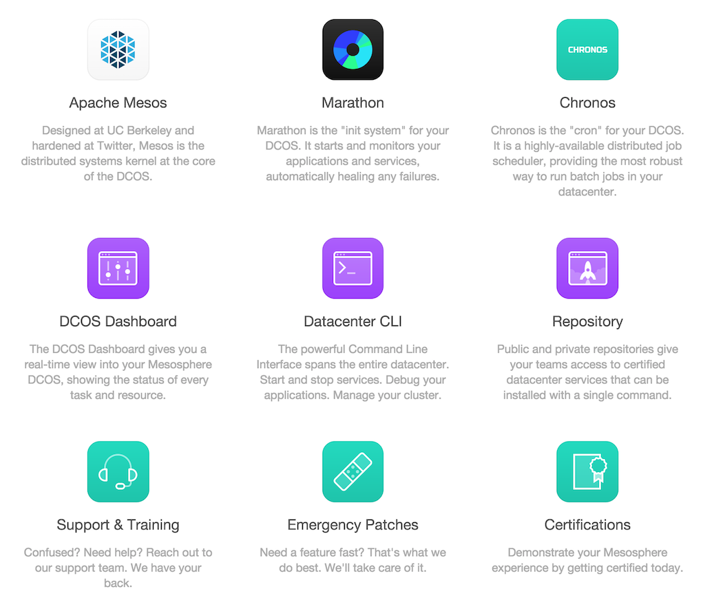

Mesosphere101
-------------

### 1. [learn](https://mesosphere.com/learn/)

#### 1.1 DCOS

The Mesosphere Datacenter Operating System

The Mesosphere DCOS includes a distributed systems kernel with enterprise-grade security, based on **Apache Mesos**, and a set of core system services, including an **init system (Marathon)**, **cron (Chronos)**, **service discovery (DNS)**, **storage (HDFS)**, and others. It is highly adaptable, employing plug-ins for native Linux containers, Docker containers, and other emerging container systems. Automating standard operations, the Mesosphere DCOS is **highly-elastic**, **highly-available** and **fault-tolerant**.

#### 1.2 Datacenter services

include Apache Spark, Apache Cassandra, Apache Kafka, Apache Hadoop, Apache YARN, Apache HDFS, Google’s Kubernetes, and more.

#### 1.3 Any Platform, Any Cloud

The Mesosphere DCOS supports all modern versions of Linux including:**CoreOS**, **CentOS**, **Ubuntu** and **RedHat**.

It runs on-premise on bare metal or in a virtualized **private** cloud, such as with **VMware** or **OpenStack**.

It also runs on all the major **public** cloud services, including **Amazon Web Services**, **Google Compute Engine**,**Digital Ocean**, Microsoft **Azure**, **Rackspace** and **VMware vCloud Air**.

### 2. [product](https://mesosphere.com/product/) & [downloads](https://mesosphere.com/downloads/)



#### 2.1 Repository Setup

Debian / Ubuntu

```
# Setup
sudo apt-key adv --keyserver keyserver.ubuntu.com --recv E56151BF
DISTRO=$(lsb_release -is | tr '[:upper:]' '[:lower:]')
CODENAME=$(lsb_release -cs)

# Add the repository
echo "deb http://repos.mesosphere.io/${DISTRO} ${CODENAME} main" | \
sudo tee /etc/apt/sources.list.d/mesosphere.list
sudo apt-get -y update
```

RedHat 6 / CentOS 6

```
# Add the repository
sudo rpm -Uvh http://repos.mesosphere.io/el/6/noarch/RPMS/mesosphere-el-repo-6-2.noarch.rpm
```

RedHat 7 / CentOS 7

```
# Add the repository
sudo rpm -Uvh http://repos.mesosphere.io/el/7/noarch/RPMS/mesosphere-el-repo-7-1.noarch.rpm
```

#### 2.2 Apache Mesos

Designed at UC Berkeley and hardened at Twitter, Mesos is the distributed systems kernel at the core of the DCOS.

-	[Source on GitHub](https://github.com/apache/mesos/tree/master)
-	[Getting started instructions](https://mesos.apache.org/gettingstarted/)
-	[Document](https://mesos.apache.org/documentation/)
-	[Download](https://mesosphere.com/downloads/details/index.html#apache-mesos)

```
sudo apt-get -y install mesos
sudo yum -y install mesos
```

#### 2.3 Marathon

Marathon is the "init system" for your DCOS. It starts and monitors your applications and services, automatically healing any failures.

-	[Source on GitHub](https://github.com/mesosphere/marathon)
-	[Document](https://mesosphere.github.io/marathon/docs/)
-	[Download](https://mesosphere.com/downloads/details/index.html#marathon)

```
sudo apt-get -y install marathon
sudo yum -y install marathon
```

#### 2.4 Chronos

Chronos is the "cron" for your DCOS. It is a highly-available distributed job scheduler, providing the most robust way to run batch jobs in your datacenter.

-	[Source on GitHub](https://github.com/airbnb/chronos)
-	[Download](https://mesosphere.com/downloads/details/index.html#chronos)

```
sudo apt-get -y install chronos
sudo yum -y install chronos
```

#### 2.5 DCOS Dashboard

The DCOS Dashboard gives you a real-time view into your Mesosphere DCOS, showing the status of every task and resource.

#### 2.6 Datacenter CLI

The powerful Command Line Interface spans the entire datacenter. Start and stop services. Debug your applications. Manage your cluster.

#### 2.7 Repository

Public and private repositories give your teams access to certified datacenter services that can be installed with a single command.
