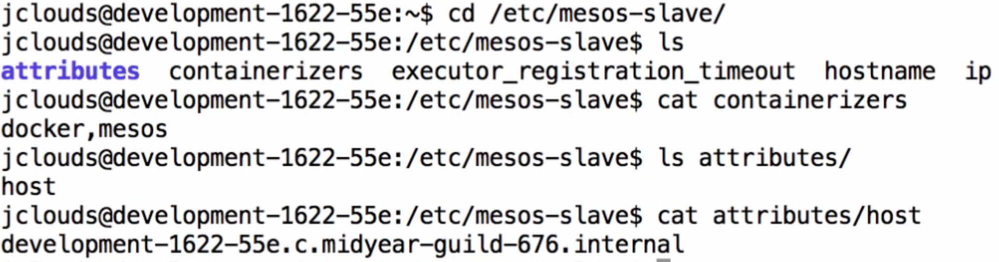
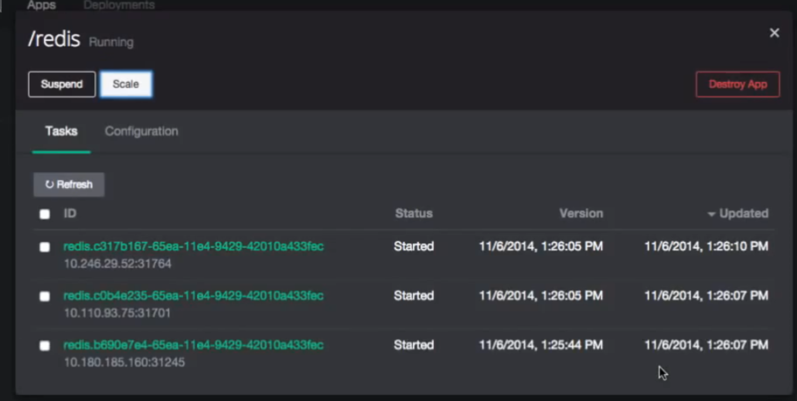
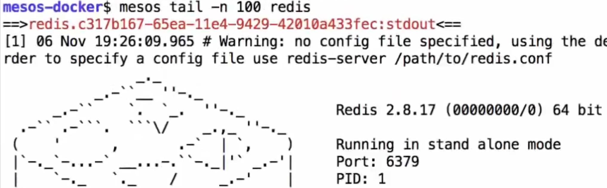
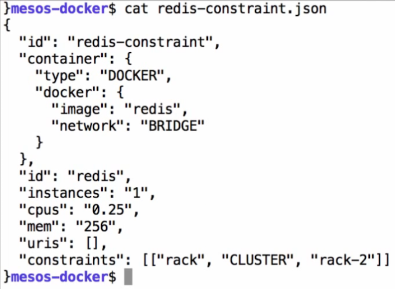

google.mesosphere.io体验
====

> 内容来自youtube上的视频《Docker Clustering on Mesos with Marathon》。

本示例使用[google.mesosphere.io](http://google.mesosphere.io)创建mesosphere环境，环境的宿主虚拟机存储在[console.developers.google.com](https://console.developers.google.com)相应帐号的项目中。

1 拓扑
------

示例采用了1主3附的拓扑结构，4台主机由google.mesosphere.io自动生成。示意如下： 

请仔细辨认主机名和IP，掌握逻辑关系，余文将以此来区分。mesos slave的序号至上而下分别称呼为第一台到第三台。

2 简述
------

### 2.1 development-1622-55e

通过VPN+SSH进入主机名为development-1622-55e的mesos slave（见下图），可以看到该主机配置了mesos console和marathon，地址都指向mesos master(10.67.63.236)。 该主机启动了mesos-slave、Docker、HAProxy、ZK和Hadoop。

mesos-slave的目录位于/etc/mesos-slave，containerizers里包含2个容器：docker和mesos， 该主机只有一个属性host，值为该主机的完整名称。

### 2.2 development-1622-1eb

另一台mesos slave（见下图）情况相仿。

不同的是，该主机多了一个rack属性，该属性用于标识自己作为mesos的node 可以接收指定标识(rack)的任务，没有这个标识的主机不能接收这样的特殊任务。

第三台和本机类似。

### 2.3 mesos-docker

本机是测试机，其用户目录下通过.mesos.json定义了mesos的默认配置，包括master的地址。

本机用于向marathon提供的RESTful API发送请求，以启动docker容器。 其中launch.sh脚本封装了请求内容，json文件封装了待启动容器的配置信息。

### 3 测试

### 3.1 简单的docker测试

首先执行`mesos ps`查看mesos进程，由于没有开始任何测试，所以没有任务。 查看simple-docker.json，这是我们要测试的第一个任务。

从上图可以看到： - 这个容器将使用libmesos/ubuntu这个镜像文件 - 实例数为1 - cpu占用总资源的25% - 内存占用256MB - 容器启动将执行`while sleep 10;do date -u +%T;done`这条命令。

发送请求给marathon，如下图所示：

此时，执行`mesos ps`查看mesos进程，可以看到一个docker进程启动了

marathon提供了web界面，从中可以看到这个任务。

点击任务行，可以动态扩容。这里在scale弹窗中输入了5，就是再建立5个相同的实例： 

回到测试机终端，执行`mesos ps`查看mesos进程，呈现出5条新的任务：

进入development-1622-55e终端，查看本机docker进程，可以发现3个任务分配到了这台slave上：

### 3.2 redis容器测试

本例没有特殊之处。

容器配置：

发送请求：

### 3.3 redis容器唯一实例测试

本例通过指定主机名唯一这个约束，确保一台slave上只能启动一个redis容器。

容器配置：

发送请求：

marathon界面，可以看到3个实例分布在不同的slave上：

mesos进程：

查看实例日志：

### 3.4 标识约束测试

上文提到的rack标识是本例测试的主要目标。

容器配置，多了rack约束条件：

发送请求：

marathon界面，可以看到实例分布在后两台slave上：

### 3.5 网桥和服务发现测试：

本例使用nginx服务，测试容器对外开放端口的可用性。

容器配置：

从上图可以看到：

-	网络模式为网桥模式（bridge）
-	端口匹配为容器、服务开放80端口；注意：没有指定slave主机要匹配的端口

发送请求：

marathon界面，任务分配到第二台slave，对外开放的端口为31000：

点击任务行，将访问slave的31000端口，对应的是slave中nginx容器的80端口：

此时，访问mesos master的80端口，同样可以访问到这个nginx容器的80端口。 这是HAProxy在mesos master值守：

进入master，在终端中查看HAProxy的配置：

从上图可以看到，mesos master中的HA自动发现了nginx服务和slave开放的端口， 并将其配置到HA中。

动态扩容nginx实例，注意：同一台slave中的多个nginx容器自身开放的依然都是80端口：

从master终端中查看HAProxy的配置，可以看到新的实例被探测并配置到HA中：

### tomcat容器测试

容器配置：

从上图可以看到：

-	容器启动将执行：

	-	war包部署
	-	基于server.xml配置，修改端口替换为指定端口
	-	将修改版本拷贝配置到./conf/server-mesos.xml
	-	使用./conf/server-mesos.xml启动tomcat

发送请求：

