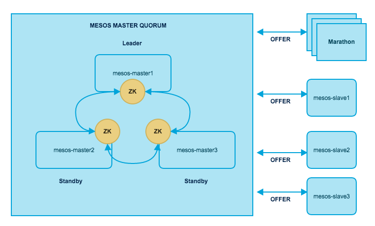
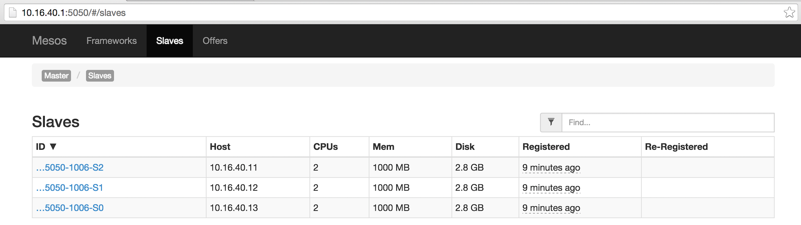
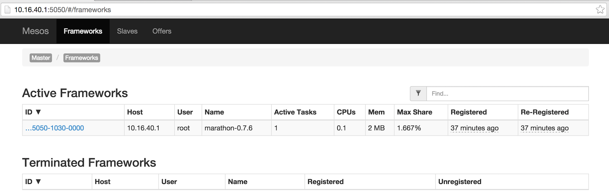
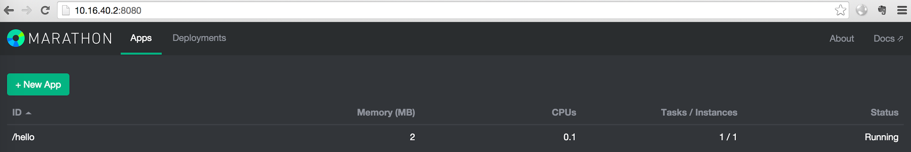
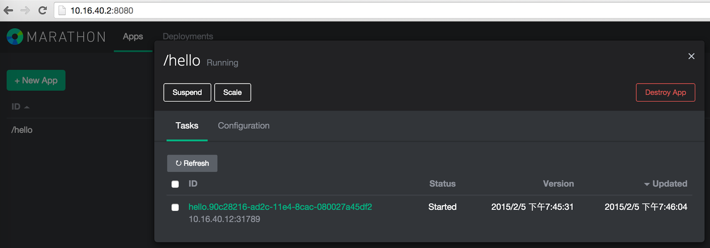
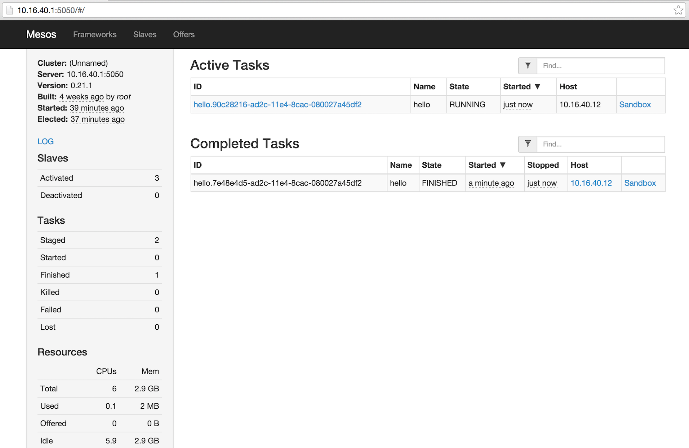
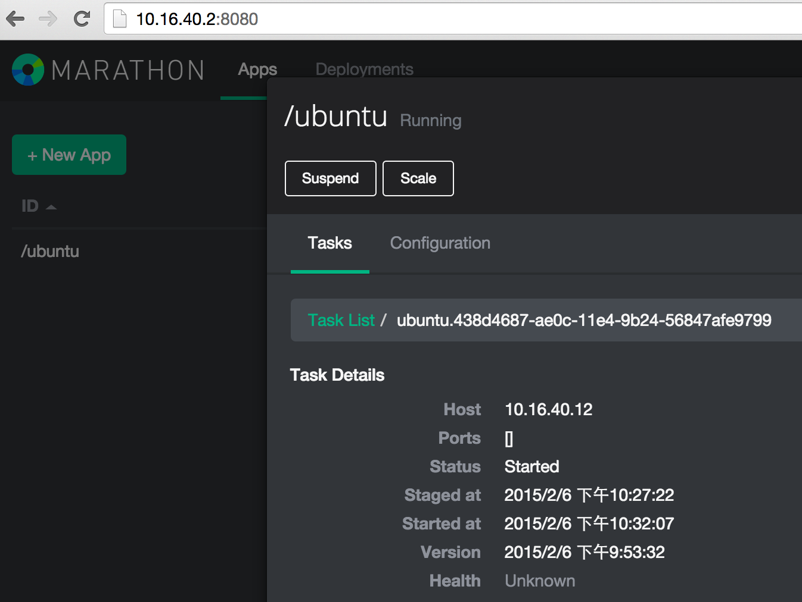
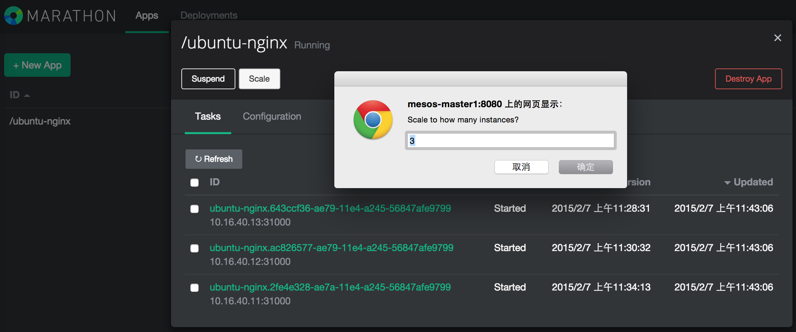
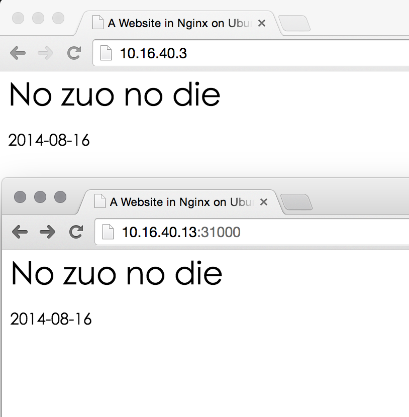
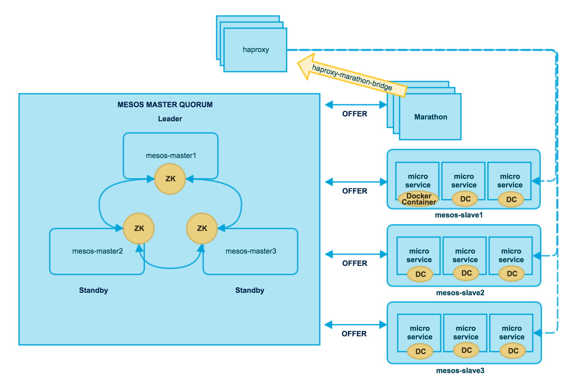

mesosphere实战
---------------

### 0. 实战概要

#### 拓扑



#### 虚拟机


| Logic Name    | Hostname & IP Address | Services                        |
|:--------------|:----------------------|:--------------------------------|
| mesos-master1 | 10.16.40.1            | ZooKeeper Mesos-master Marathon |
| mesos-master2 | 10.16.40.2            | ZooKeeper Mesos-master Marathon |
| mesos-master3 | 10.16.40.3            | ZooKeeper Mesos-master Marathon |
| mesos-slave1  | 10.16.40.11           | Mesos-slave                     |
| mesos-slave2  | 10.16.40.12           | Mesos-slave                     |
| mesos-slave3  | 10.16.40.13           | Mesos-slave                     |

#### 基础安装

-	配置APT

```
# Setup
sudo apt-key adv --keyserver keyserver.ubuntu.com --recv E56151BF
DISTRO=$(lsb_release -is | tr '[:upper:]' '[:lower:]')
CODENAME=$(lsb_release -cs)

# Add the repository
echo "deb http://repos.mesosphere.io/${DISTRO} ${CODENAME} main" | \
sudo tee /etc/apt/sources.list.d/mesosphere.list
sudo apt-get -y update
```

-	Mesos Master安装mesos marathon

```
sudo apt-get install -y mesos marathon
```

-	Mesos Slave安装mesos

```
sudo apt-get install -y mesos
```

### 1. Ubuntu网络设置

设置静态IP前，先查看网关

```
route -n
Kernel IP routing table
Destination     Gateway         Genmask         Flags Metric Ref    Use Iface
0.0.0.0         10.16.41.254    0.0.0.0         UG    0      0        0 eth0
10.16.40.0      0.0.0.0         255.255.254.0   U     0      0        0 eth0
172.17.0.0      0.0.0.0         255.255.0.0     U     0      0        0 docker0
```

-	sudo nano /etc/network/interfaces

```
auto eth0
#iface eth0 inet dhcp
iface eth0 inet static
address 10.16.40.1
netmask 255.255.254.0
gateway 10.16.41.254
dns-nameservers 8.8.8.8
```

-	sudo nano /etc/hostname

```
10.16.40.1
```

-	nano .bashrc

```
export PS1="[\u@\H \W] \$ "
```

```
. .bashrc
```

-	sudo nano /etc/hosts

```
127.0.0.1	localhost
::1     localhost ip6-localhost ip6-loopback
ff02::1 ip6-allnodes
ff02::2 ip6-allrouters
```

### 2. ZK配置「Mesos Master」

-	设置实例id

```
sudo nano /etc/zookeeper/conf/myid

1
```

-	配置实例

```
sudo nano /etc/zookeeper/conf/zoo.cfg

server.1=10.16.40.1:2888:3888
server.2=10.16.40.2:2888:3888
server.3=10.16.40.3:2888:3888
```

```
sudo nano /etc/mesos/zk
zk://10.16.40.1:2181,10.16.40.2:2181,10.16.40.3:2181/mesos
```

### 3. Mesos Master配置「Mesos Master」

-	设置quorum

```
sudo nano /etc/mesos-master/quorum

2
```

-	设置主机IP和Hostname

```
echo 10.16.40.1 | sudo tee /etc/mesos-master/ip
sudo cp /etc/mesos-master/ip /etc/mesos-master/hostname
cat /etc/mesos-master/hostname
```

### 4. Marathon配置「Mesos Master」

-	配置Hostname

```
sudo mkdir -p /etc/marathon/conf
sudo cp /etc/mesos-master/hostname /etc/marathon/conf
cat /etc/marathon/conf/hostname

10.16.40.1
```

-	配置ZK以访问mesos master

```
sudo cp /etc/mesos/zk /etc/marathon/conf/master
cat /etc/marathon/conf/master

zk://10.16.40.1:2181,10.16.40.2:2181,10.16.40.3:2181/mesos
```

```
sudo cp /etc/marathon/conf/master /etc/marathon/conf/zk
sudo nano /etc/marathon/conf/zk
zk://10.16.40.1:2181,10.16.40.2:2181,10.16.40.3:2181/marathon
```

### 5. 服务重启「Mesos Master」

-	停止mesos-slave服务

```
echo manual | sudo tee /etc/init/mesos-slave.override
```

-	重启服务

```
sudo restart zookeeper
sudo start mesos-master
sudo start marathon

http://10.16.40.1:5050
```

### 6. Mesos Slave配置「Mesos Slave」

-	去ZK

```
sudo stop zookeeper && echo manual | sudo tee /etc/init/zookeeper.override
```

-	去Mesos Master

```
echo manual | sudo tee /etc/init/mesos-master.override && sudo stop mesos-master
```

-	配置Hostname和IP

```
echo 10.16.40.11 | sudo tee /etc/mesos-slave/ip
sudo cp /etc/mesos-slave/ip /etc/mesos-slave/hostname
cat /etc/mesos-slave/hostname

```

-	配置ZK以访问Mesos Master

```
echo zk://10.16.40.1:2181,10.16.40.2:2181,10.16.40.3:2181/mesos | sudo tee /etc/mesos/zk
```

-	起Mesos Slave

```
sudo start mesos-slave
```

-	Mesos Master页面之Slave列表 

-	Mesos Master页面之Framework列表 

### 7. 动态添加服务

-	service.json

```json
{ "id": "hello", "cmd": "echo hello world; sleep 30", "mem": 2, "cpus": 0.1, "instances": 1, "disk": 0.0, "ports": [0] }
```

-	向Marathon请求服务

```
curl -i -H 'Content-Type: application/json' -d@service.json 10.16.40.1:8080/v2/apps

HTTP/1.1 201 Created
Location: http://10.16.40.1:8080/v2/apps/hello
Content-Type: application/json
Transfer-Encoding: chunked
Server: Jetty(8.y.z-SNAPSHOT)

{"id":"/hello","cmd":"echo hello world; sleep 30","args":null,"user":null,"env":{},"instances":1,"cpus":0.1,"mem":2.0,"disk":0.0,"executor":"","constraints":[],"uris":[],"storeUrls":[],"ports":[0],"requirePorts":false,"backoffSeconds":1,"backoffFactor":1.15,"container":null,"healthChecks":[],"dependencies":[],"upgradeStrategy":{"minimumHealthCapacity":1.0},"version":"2015-02-05T11:45:31.026Z"}
```

-	Marathon任务列表



-	Marathon任务详情



-	Mesos Master首页



### 8. Docker

Mesos环境搭好后，我们开始让这套环境支持Docker并具有负载均衡的能力。

| Logic Name    | Hostname & IP Address | Services                                       |
|:--------------|:----------------------|:-----------------------------------------------|
| mesos-master1 | 10.16.40.1            | ZooKeeper Mesos-master Marathon HAProxy Docker |
| mesos-master2 | 10.16.40.2            | ZooKeeper Mesos-master Marathon HAProxy Docker |
| mesos-master3 | 10.16.40.3            | ZooKeeper Mesos-master Marathon HAProxy Docker |
| mesos-slave1  | 10.16.40.11           | Mesos-slave Docker                             |
| mesos-slave2  | 10.16.40.12           | Mesos-slave Docker                             |
| mesos-slave3  | 10.16.40.13           | Mesos-slave Docker                             |

#### 安装

```
curl -sSL https://get.docker.com/ubuntu/ | sudo sh
sudo docker version

Client version: 1.4.1
Client API version: 1.16
Go version (client): go1.3.3
Git commit (client): 5bc2ff8
OS/Arch (client): linux/amd64
Server version: 1.4.1
Server API version: 1.16
Go version (server): go1.3.3
Git commit (server): 5bc2ff8
```

#### 配置Mesos Slave

```
sudo sh -c "echo 'docker,mesos' > /etc/mesos-slave/containerizers"
sudo sh -c "echo '5mins' > /etc/mesos-slave/executor_registration_timeout"

cat /etc/mesos-slave/containerizers
docker,mesos
```

#### 准备镜像

```
# [docker.alibaba.net]
sudo docker save -o libmesos-ubuntu.tar libmesos/ubuntu
scp libmesos-ubuntu.tar erichan@10.16.40.12:/home/erichan/

# [mesos slave2]
sudo docker load -i libmesos-ubuntu.tar
sudo docker images --tree
```

### 9. 动态添加Docker容器

Mesos的Docker环境搭好了，我们先进行一个基本的Docker容器测试。

-	docker_service.json

```json
{
  "container": {
    "type": "DOCKER",
    "docker": {
      "image": "libmesos/ubuntu"
    }
  },
  "id": "ubuntu",
  "instances": 1,
  "cpus": 0.5,
  "mem": 512,
  "uris": [],
  "cmd": "while sleep 10; do date -u +%T; done"
}
```

-	向Marathon请求服务

```
curl -i -H 'Content-Type: application/json' -d@docker_service.json 10.16.40.1:8080/v2/apps
```

-	Marathon任务详情



### 10.HA配置

-	主机 marathon源代码

```
cd sourcecode/marathon/bin/

ls
build-distribution      haproxy-marathon-bridge marathon-framework      start

scp haproxy-marathon-bridge erichan@mesos-master2:/home/erichan/
```

-	虚拟机 使用haproxy-marathon-bridge脚本安装并配置haproxy

```
sudo mv haproxy-marathon-bridge /usr/local/bin/
haproxy-marathon-bridge install_haproxy_system localhost:8080

cat /etc/default/haproxy

cat /etc/cron.d/haproxy-marathon-bridge
```

### 11. 动态负载

现在HA也加入了这套环境，我们使用一个Nginx的Docker镜像来测试HA。

#### nginx镜像

-	Dockerfile

```
# Version: 0.0.2
FROM feuyeux/ubuntu-base
MAINTAINER Eric Han "feuyeux@gmail.com"
RUN apt-get update
RUN apt-get -yq install nginx
RUN mkdir -p /var/www/html
ADD nginx/global.conf /etc/nginx/conf.d/
ADD nginx/nginx.conf /etc/nginx/nginx.conf
ADD website /var/www/html/website
ENTRYPOINT ["nginx"]
EXPOSE 80

```

-	构建

```
d build -t=feuyeux/nginx .
```

-	搬运

```
# [docker.alibaba.net]
sudo docker save -o feuyeux-nginx.tar feuyeux/nginx
scp feuyeux-nginx.tar erichan@10.16.40.12:/home/erichan/

# [mesos slave2]
sudo docker load -i feuyeux-nginx.tar
sudo docker images --tree
```

-	docker_nginx.json

```json
{
  "container": {
    "type": "DOCKER",
    "docker": {
      "image": "feuyeux/nginx",
      "network":"BRIDGE",
      "portMappings":[
      {"containerPort":80,"hostPort":0,"servicePort":80,"protocol":"tcp"}
      ]
    }
  },
  "id": "nginx",
  "instances": 1,
  "cpus": 0.25,
  "mem": 256,
  "uris": []
}
```

-	向Marathon请求服务

```
curl -i -H 'Content-Type: application/json' -d@docker_nginx.json 10.16.40.2:8080/v2/apps

HTTP/1.1 201 Created
Location: http://10.16.40.1:8080/v2/apps/ubuntu-nginx
Content-Type: application/json
Server: Jetty(8.y.z-SNAPSHOT)
Content-Length: 581

{"id":"/ubuntu-nginx","cmd":null,"args":null,"user":null,"env":{},"instances":1,"cpus":0.25,"mem":256.0,"disk":0.0,"executor":"","constraints":[],"uris":[],"storeUrls":[],"ports":[],"requirePorts":false,"backoffSeconds":1,"backoffFactor":1.15,"container":{"type":"DOCKER","volumes":[],"docker":{"image":"feuyeux/nginx","network":"BRIDGE","portMappings":[{"containerPort":80,"hostPort":0,"servicePort":80,"protocol":"tcp"}],"privileged":false,"parameters":{}}},"healthChecks":[],"dependencies":[],"upgradeStrategy":{"minimumHealthCapacity":1.0},"version":"2015-02-07T03:28:31.617Z"}
```

- 扩容docker nginx容器



-	观察ha配置

```
cat /etc/haproxy/haproxy.cfg
global
daemon
log 127.0.0.1 local0
log 127.0.0.1 local1 notice
maxconn 4096

defaults
log            global
retries             3
maxconn          2000
timeout connect  5000
timeout client  50000
timeout server  50000

listen stats
bind 127.0.0.1:9090
balance
mode http
stats enable
stats auth admin:admin

listen ubuntu-nginx-80
bind 0.0.0.0:80
mode tcp
option tcplog
balance leastconn
server ubuntu-nginx-3 10.16.40.11:31000 check
server ubuntu-nginx-2 10.16.40.12:31000 check
server ubuntu-nginx-1 10.16.40.13:31000 check
```

-	访问Slave·Nginx/Master·HAProxy



到此完成mesosphere实战。



> 参考

-	[mesosphere部分](http://mesosphere.com/docs/getting-started/datacenter/install/)
-	[docker部分1](http://mesosphere.com/docs/tutorials/launch-docker-container-on-mesosphere/)
-	[docker部分2](https://mesosphere.github.io/marathon/docs/native-docker.html)
-	[haproxy部分](https://mesosphere.github.io/marathon/docs/service-discovery-load-balancing.html)

### 附录

#### 解读haproxy-marathon-bridge脚本

-	**命令**：`haproxy-marathon-bridge install_haproxy_system localhost:8080`
-	**流程**：

	-	函数：install_haproxy_system
	-	功能：根据当前系统安装haproxy，目前支持CentOS/RHEL/AmazonAMI、Ubuntu/Debian

	-	函数：install_cronjob 参数：localhost:8080

	-	功能：创建**/etc/haproxy-marathon-bridge/marathons**，写入`localhost:8080`；创建可读可执行文件**/usr/local/bin/haproxy-marathon-bridge**

		-	函数：cronjob
		-	功能：写入**/etc/cron.d/haproxy-marathon-bridge**:`* * * * * root /usr/local/bin/haproxy-marathon-bridge logged refresh_system_haproxy $(cat /etc/haproxy-marathon-bridge/marathons)`
		-	函数：header
		-	功能：将标准配置写入**/etc/haproxy/haproxy.cfg**：

```
global
daemon
log 127.0.0.1 local0
log 127.0.0.1 local1 notice
maxconn 4096


defaults
log            global
retries             3
maxconn          2000
timeout connect  5000
timeout client  50000
timeout server  50000


listen stats
bind 127.0.0.1:9090
balance
mode http
stats enable
stats auth admin:admin
```

-	**命令**：`haproxy-marathon-bridge logged refresh_system_haproxy $(cat /etc/haproxy-marathon-bridge/marathons)`
-	**流程**：

-	函数：logged

-	功能：重定向标准输出和错误输出

	-	函数：refresh_system_haproxy 参数：localhost:8080
		-	函数：config 参数：localhost:8080
		-	功能：将ha标准配置和apps的追加配置一并返回
			-	函数：apps 参数：localhost:8080
			-	功能：执行`curl -sSfLk -m 10 -H 'Accept: text/plain' localhost:8080/v2/tasks`，从marathon获取当前tasks信息（应用名、端口），追加到ha配置中。
	-	功能：diff ha配置和/etc/haproxy/haproxy.cfg，替换配置并reload haproxy。

#### curl 关键参数说明

-	-s, --silent Silent or quiet mode. Don't show progress meter or error messages. Makes Curl mute. It will still output the data you ask for, poten‐ tially even to the terminal/stdout unless you redirect it.

-	-f, --fail (HTTP) Fail silently (no output at all) on server errors. This is mostly done to better enable scripts etc to better deal with failed attempts. In normal cases when an HTTP server fails to deliver a document, it returns an HTML document stating so (which often also describes why and more). This flag will prevent curl from outputting that and return error 22. This method is not fail-safe and there are occasions where non-successful response codes will slip through, especially when authentica‐ tion is involved (response codes 401 and 407).

-	-L, --location (HTTP/HTTPS) If the server reports that the requested page has moved to a different location (indicated with a Location: header and a 3XX response code), this option will make curl redo the request on the new place. If used together with -i, --include or -I, --head, headers from all requested pages will be shown. When authentication is used, curl only sends its credentials to the initial host. If a redirect takes curl to a different host, it won't be able to intercept the user+password. See also --location-trusted on how to change this. You can limit the amount of redirects to follow by using the --max-redirs option. When curl follows a redirect and the request is not a plain GET (for example POST or PUT), it will do the following request with a GET if the HTTP response was 301, 302, or 303. If the response code was any other 3xx code, curl will re-send the following request using the same unmodified method.

-	-S, --show-error When used with -s it makes curl show an error message if it fails.

-	-k, --insecure (SSL) This option explicitly allows curl to perform "insecure" SSL connections and transfers. All SSL connections are attempted to be made secure by using the CA certificate bundle installed by default. This makes all connections considered "insecure" fail unless -k, --insecure is used. See this online resource for further details: http://curl.haxx.se/docs/sslcerts.html
