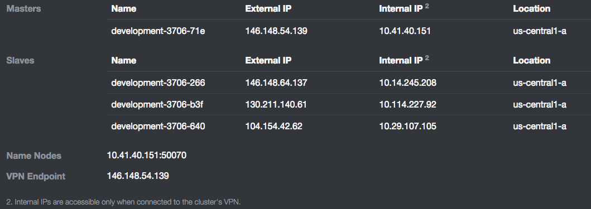
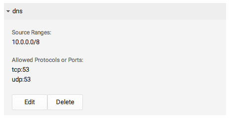

基于Google云平台的Mesos-DNS
----

本文将一步步演示如何结合基于Google云平台的Mesosphere，进行Mesos-DNS实战。

### 第一步: 启动Mesosphere集群

首先，根据[https://google.mesosphere.com/](https://google.mesosphere.com/)的指导启动一个开发模式的Mesosphere集群。为此，你需要一个[Google云平台](https://cloud.google.com/)的帐号和一个开通支付功能的激活的项目。

开发模式的Mesosphere集群包括一台master和3台slave。本文的集群信息如下图所示。全部节点的示例将使用内部IP(internal IP)。集群上运行了Mesos (版本0.21.1)和Marathon(版本0.7.6)。



[Google云平台](https://cloud.google.com/)默认阻止53端口。可以根据这份[指导](http://stackoverflow.com/questions/21065922/how-to-open-a-specific-port-such-as-9090-in-google-compute-engine)解除对53端口的阻止。注意，需要同时解除TCP和UCP对53端口的阻止。最后，如果检测集群的防火墙规则，需包含如下图所示的规则，这将在10.0.0.0子网打开TCP和UDP的53端口。



### 第二步: 构建和安装Mesos-DNS

我们将在**10.14.245.208**节点构建和安装Mesos-DNS，可以通过如下ssh命令访问该节点：

```
ssh jclouds@10.14.245.208
```

安装和构建go语言的过程如下：

```
sudo apt-get install git-core
wget https://storage.googleapis.com/golang/go1.4.linux-amd64.tar.gz
tar xzf go*
sudo mv go /usr/local/.
export PATH=$PATH:/usr/local/go/bin
export GOROOT=/usr/local/go
export PATH=$PATH:$GOROOT/bin
export GOPATH=$HOME/go
```

现在我们准备好编译Mesos-DNS了：

```
go get github.com/miekg/dns
go get github.com/mesosphere/mesos-dns
cd $GOPATH/src/github.com/mesosphere/mesos-dns
go build -o mesos-dns main.go
sudo mkdir /usr/local/mesos-dns
sudo mv mesos-dns /usr/local/mesos-dns
```

在同一目录下（/usr/local/mesos-dns），创建config.json文件，内容如下：

```
$ cat /usr/local/mesos-dns/config.json
{
  "masters": ["10.41.40.151:5050"],
  "refreshSeconds": 60,
  "ttl": 60,
  "domain": "mesos",
  "port": 53,
  "resolvers": ["169.254.169.254","10.0.0.1"],
  "timeout": 5,
  "email": "root.mesos-dns.mesos"
}
```

resolvers字段包含的两个nameserver来自于这个集群节点的/etc/resolv.conf文件。

### 第三步: 启动Mesos-DNS

我们将从master节点（10.41.40.151）启动Mesos-DNS。可以通过如下ssh命令访问该节点：

```
ssh jclouds@10.41.40.151
```

使用Marathon来启动Mesos-DNS以实现容错。如果Mesos-DNS崩溃，Marathon将自动重启Mesos-DNS。创建mesos-dns.json文件，内容如下：

```
$ more mesos-dns.json
{
"cmd": "sudo  /usr/local/mesos-dns/mesos-dns -v -config=/usr/local/mesos-dns/config.json",
"cpus": 1.0,
"mem": 1024,
"id": "mesos-dns",
"instances": 1,
"constraints": [["hostname", "CLUSTER", "10.14.245.208"]]
}
```

使用如下命令启动Mesos-DNS：

```
curl -X POST -H "Content-Type: application/json" http://10.41.40.151:8080/v2/apps -d@mesos-dns.json
```

这条命令告诉Marathon启动10.14.245.208节点上的Mesos-DNS。选项-v允许捕获Mesos-DNS日志中warning/error级别输出的详情，或将有助于调试。举例说明，Mesos-DNS会周期性打印服务器的全部A和SRV记录的标准输出信息。当你想了解任务和Mesos的各种framework在你的环境中是如何命名时非常有用。你可以通过Mesos的Web图形界面访问Mesos-DNS的标准输出和错误输出，本例的相应地址是http://10.41.40.151:5050。

### 第四步: 配置集群节点

下面，我们将为集群中的所有节点配置Mesos-DNS作为他们的DNS服务器。使用ssh访问每个节点并执行如下命令：

```
sudo sed -i '1s/^/nameserver 10.14.245.208\n /' /etc/resolv.conf
```

可以使用如下命令验证配置是否正确，以及Mesos-DNS是否是提供DNS检索服务的服务器：

```
$ cat /etc/resolv.conf
nameserver 10.14.245.208
 domain c.myproject.internal.
search c.myprojecct.internal. 267449633760.google.internal. google.internal.
nameserver 169.254.169.254
nameserver 10.0.0.1
$ host www.google.com
www.google.com has address 74.125.70.104
www.google.com has address 74.125.70.147
www.google.com has address 74.125.70.99
www.google.com has address 74.125.70.105
www.google.com has address 74.125.70.106
www.google.com has address 74.125.70.103
www.google.com has IPv6 address 2607:f8b0:4001:c02::93
```
为了百分百确定Mesos-DNS就是提供以上传输的服务器，我们可以使用如下命令尝试：

```
$ sudo apt-get install dnsutils
$ dig www.google.com

; <<>> DiG 9.8.4-rpz2+rl005.12-P1 <<>> www.google.com
;; global options: +cmd
;; Got answer:
;; ->>HEADER<<- opcode: QUERY, status: NOERROR, id: 45045
;; flags: qr rd ra; QUERY: 1, ANSWER: 6, AUTHORITY: 0, ADDITIONAL: 0

;; QUESTION SECTION:
;www.google.com.            IN  A

;; ANSWER SECTION:
www.google.com.     228 IN  A   74.125.201.105
www.google.com.     228 IN  A   74.125.201.103
www.google.com.     228 IN  A   74.125.201.147
www.google.com.     228 IN  A   74.125.201.104
www.google.com.     228 IN  A   74.125.201.106
www.google.com.     228 IN  A   74.125.201.99

;; Query time: 3 msec
;; SERVER: 10.14.245.208#53(10.14.245.208)
;; WHEN: Sat Jan 24 01:03:38 2015
;; MSG SIZE  rcvd: 212
```

标记SERVER的一行让我们确信，在10.14.245.208节点上监听53端口的进程提供了应答，这个进程就是Mesos-DNS。

### 第五步: 使用Mesos启动Nginx服务

现在让我们使用Mesos启动一个任务。我们将使用Marathon启动带有Nginx Web服务的Docker容器。进入master节点：

```
ssh jclouds@10.41.40.151
```

首先创建一个Nginx配置文件ngix.json：

```
$ cat ngix.json
{
  "id": "nginx",
  "container": {
    "type": "DOCKER",
    "docker": {
      "image": "nginx:1.7.7",
      "network": "HOST"
    }
  },
  "instances": 1,
  "cpus": 1,
  "mem": 640
}
```

可以在Mesos上使用如下命令启动Nginx容器：

```
curl -X POST -H "Content-Type: application/json" http://10.41.40.151:8080/v2/apps -d@ngix.json
```
这将在三台slave主机之一上启动Nginx容器，该容器使用主机网络。可以通过Marathon的Web图形界面验证该服务已经没有问题地运行了。结果是Mesos的10.114.227.92节点启动了该服务，我们使用如下命令验证Nginx服务是否工作：

	$ curl http://10.114.227.92
	<!DOCTYPE html>
	<html>
	<head>
	<title>Welcome to nginx!</title>
	<style>
	    body {
	        width: 35em;
	        margin: 0 auto;
	        font-family: Tahoma, Verdana, Arial, sans-serif;
	    }
	</style>
	</head>
	<body>
	<h1>Welcome to nginx!</h1>
	<p>If you see this page, the nginx web server is successfully installed and
	working. Further configuration is required.</p>

	<p>For online documentation and support please refer to
	<a href="http://nginx.org/">nginx.org</a>.<br/>
	Commercial support is available at
	<a href="http://nginx.com/">nginx.com</a>.</p>

	<p><em>Thank you for using nginx.</em></p>
	</body>
	</html>

### 第六步: 使用Mesos-DNS连接Nginx

现在让我们使用Mesos-DNS连接Nginx。我们将使用master节点：

```
ssh jclouds@10.41.40.151
```

首先，为Nginx做一个DNS查找，我们期待的域名是nginx.marathon-0.7.6.mesos。域名包含了Marathon的版本号因为使用Mesos注册时使用的是marathon-0.7.6名称。如果不想使用带版本号的名称，可以再启动Marathon时使用``` --framework_name marathon```参数：

```
$ dig nginx.marathon-0.7.6.mesos

; <<>> DiG 9.8.4-rpz2+rl005.12-P1 <<>> nginx.marathon-0.7.6.mesos
;; global options: +cmd
;; Got answer:
;; ->>HEADER<<- opcode: QUERY, status: NOERROR, id: 11742
;; flags: qr aa rd ra; QUERY: 1, ANSWER: 1, AUTHORITY: 0, ADDITIONAL: 0

;; QUESTION SECTION:
;nginx.marathon-0.7.6.mesos. IN A

;; ANSWER SECTION:
nginx.marathon-0.7.6.mesos. 60 IN   A   10.114.227.92

;; Query time: 0 msec
;; SERVER: 10.14.245.208#53(10.14.245.208)
;; WHEN: Sat Jan 24 01:11:46 2015
;; MSG SIZE  rcvd: 96
```

Mesos-DNS告诉我们Nginx运行在10.114.227.92节点。现在我们尝试使用域名连接：

	$ curl http://nginx.marathon-0.7.6.mesos
	<!DOCTYPE html>
	<html>
	<head>
	<title>Welcome to nginx!</title>
	<style>
	    body {
	        width: 35em;
	        margin: 0 auto;
	        font-family: Tahoma, Verdana, Arial, sans-serif;
	    }
	</style>
	</head>
	<body>
	<h1>Welcome to nginx!</h1>
	<p>If you see this page, the nginx web server is successfully installed and
	working. Further configuration is required.</p>

	<p>For online documentation and support please refer to
	<a href="http://nginx.org/">nginx.org</a>.<br/>
	Commercial support is available at
	<a href="http://nginx.com/">nginx.com</a>.</p>

	<p><em>Thank you for using nginx.</em></p>
	</body>
	</html>

我们成功地使用逻辑名称连接上了Nginx服务，Mesos-DNS运行正常！

### 第七步: 水平扩展Nginx

使用Marathon的Web图形界面将Nginx水平扩展为两个实例。也可以按照第五步重新编辑json文件，将instances设置为2，然后重新启动Nginx服务。一分钟后，我们使用Mesos-DNS又可以重新获取到Nginx服务：

```
$  dig nginx.marathon-0.7.6.mesos

; <<>> DiG 9.8.4-rpz2+rl005.12-P1 <<>> nginx.marathon-0.7.6.mesos
;; global options: +cmd
;; Got answer:
;; ->>HEADER<<- opcode: QUERY, status: NOERROR, id: 30550
;; flags: qr aa rd ra; QUERY: 1, ANSWER: 2, AUTHORITY: 0, ADDITIONAL: 0

;; QUESTION SECTION:
;nginx.marathon-0.7.6.mesos. IN A

;; ANSWER SECTION:
nginx.marathon-0.7.6.mesos. 60 IN   A   10.29.107.105
nginx.marathon-0.7.6.mesos. 60 IN   A   10.114.227.92

;; Query time: 1 msec
;; SERVER: 10.14.245.208#53(10.14.245.208)
;; WHEN: Sat Jan 24 01:24:07 2015
;; MSG SIZE  rcvd: 143
```
现在，Mesos-DNS为我们提供了同一个域名的2个A记录，表示集群中包含两个Nginx服务。
