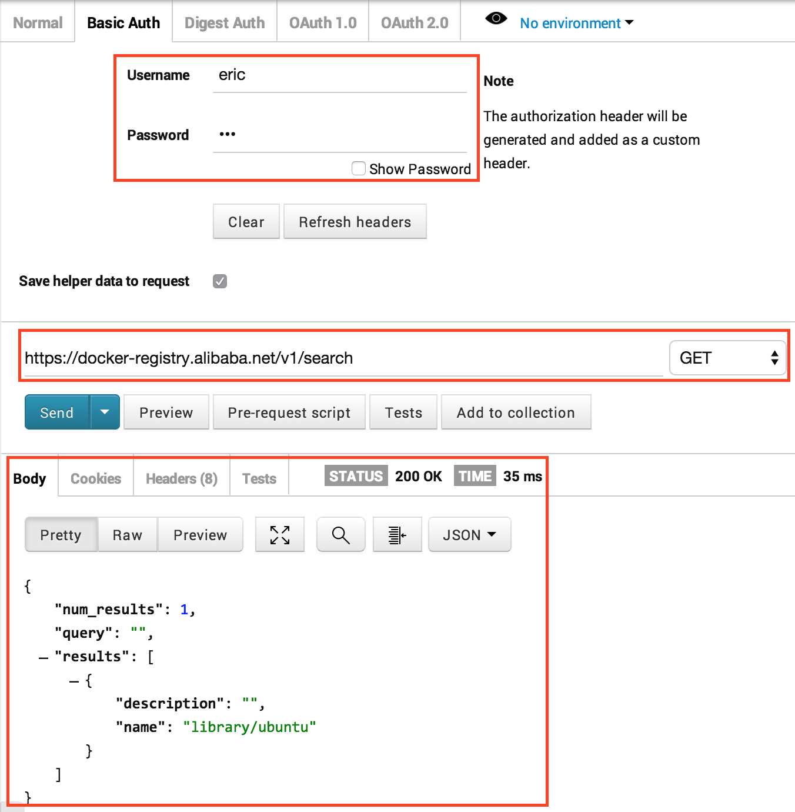

### Docker私服域名
docker-registry.alibaba.net

### HTTP BASIC
在Docker Host，为HTTP基本认证添加用户和密码

```
sudo apt-get install -y apache2-utils
htpasswd -b -c -d docker-registry.htpasswd eric han
```

### SSL证书

#### 初始化CA证书
```
mkdir nginx-auth
echo 01 > ca.srl
```
#### 生成CA私钥
```
openssl genrsa -des3 -out ca-key.pem 2048 
Enter pass phrase for ca-key.pem:eric
```
#### 生成根证书/CA自签证书（CSR）
```
openssl req -new -x509 -days 365 -key ca-key.pem -out ca.pem
```
#### 生成服务器的私钥
```
openssl genrsa -des3 -out server-key.pem 2048
Enter pass phrase for server-key.pem:eric
```
#### 生成服务器的自签证书
```
openssl req -subj /CN=docker-registry.alibaba.net -new -key server-key.pem -out server.csr
Enter pass phrase for server-key.pem:eric
```
#### 生成CA颁发的服务器证书
```
openssl x509 -req -days 365 -in server.csr -CA ca.pem -CAkey ca-key.pem -out server-cert.pem
```
We should remove the passphrase from server key:
```openssl rsa -in server-key.pem -out server-key.pem```


### Nginx容器

#### Dockerfile 
```
# Version: 0.0.1
FROM feuyeux/nginx:1.0
MAINTAINER Eric Han "feuyeux@gmail.com"
ADD nginx-auth/server-cert.pem /etc/ssl/certs/docker-registry
ADD nginx-auth/server-key.pem /etc/ssl/private/docker-registry
ADD nginx-auth/nginx.conf /etc/nginx/
ADD nginx-auth/nginx.default /etc/nginx/sites-enabled/default
ADD nginx-auth/docker-registry.htpasswd /etc/nginx/
```

#### docker-registry.htpasswd 
```
eric:ZsF.CKxpJSWLs
```

#### nginx.conf

```
user www-data;
worker_rlimit_nofile 32768;
pid /var/run/nginx.pid;

events {
  worker_connections 8192;
}

http {
  ## Basic Settings
  sendfile on;
  tcp_nopush on;
  tcp_nodelay on;
  keepalive_timeout 65;
  types_hash_max_size 2048;
  # server_tokens off;

  # server_names_hash_bucket_size 64;
  # server_name_in_redirect off;

  include /etc/nginx/mime.types;
  default_type application/octet-stream;

  ## Logging Settings
  access_log /dev/stdout;
  error_log /dev/stdout;

  ## Gzip Settings
  gzip on;
  gzip_disable "msie6";

  include /etc/nginx/conf.d/*.conf;
  include /etc/nginx/sites-enabled/default;
}

daemon off;
```

#### nginx.default
```json
upstream docker-registry {
  server registry:5000;
}

server {
  listen 443; # 只提供HTTPS、没有提供HTTP
  server_name docker-registry.alibaba.net;
  
  ssl on;
  ssl_certificate /etc/ssl/certs/docker-registry; #HTTPS 证书
  ssl_certificate_key /etc/ssl/private/docker-registry; #HTTPS 密钥

  proxy_set_header  Host           $http_host;   # required for docker client's sake
  proxy_set_header  X-Real-IP      $remote_addr; # pass on real client's IP
  proxy_set_header  Authorization  ""; # see https://github.com/dotcloud/docker-registry/issues/170
  proxy_read_timeout               900;

  client_max_body_size 0;                  # disable any limits to avoid HTTP 413 for large image uploads
  chunked_transfer_encoding on;            # required to avoid HTTP 411: see Issue #1486 (https://github.com/dotcloud/docker/issues/1486)

  root  /usr/local/nginx/html;
  index  index.html index.htm;

  location / {
    auth_basic            "Restricted";
    auth_basic_user_file  docker-registry.htpasswd;  # testuser:testpasswd & larrycai:passwd #HTTP BASIC 认证
    proxy_pass                http://docker-registry; # 反向代理到5000端口
  }

  location /auth {
    auth_basic            "Restricted";
    auth_basic_user_file  docker-registry.htpasswd;  # testuser:testpasswd & larrycai:passwd
    proxy_pass                http://docker-registry;
  }

  
  location /v1/_ping {
    auth_basic off;
    proxy_pass                http://docker-registry;
  }

  location /_ping {
    auth_basic off;
    proxy_pass                http://docker-registry;
  }
}
```

### 构建Nginx镜像
```
d build -t="feuyeux/nginx443" .
```

### 让Docker Host信任CA
```
sudo sh -c "cat ca.pem >> /etc/ssl/certs/ca-certificates.crt"
重启Docker Daemon
docker restart
```

### 启动Docker私服
```
docker run -d --name registry -p 5000:5000 registry
docker run -d --name nginx -p 443:443 --link registry:registry feuyeux/nginx443

d ps
CONTAINER ID        IMAGE                     COMMAND             CREATED             STATUS              PORTS                                  NAMES
c5c4a8dc9901        feuyeux/nginx443:latest   "nginx"             3 hours ago         Up 3 hours          22/tcp, 80/tcp, 0.0.0.0:443->443/tcp   nginx               
62c4afd81dea        registry:latest           "docker-registry"   3 hours ago         Up 3 hours          0.0.0.0:5000->5000/tcp                 registry            
```

### 测试Docker私服

```
d login -u eric -p han docker-registry.alibaba.net
d tag ubuntu docker-registry.alibaba.net/ubuntu
d push feuyeux/nginx
```

### 浏览器访问以校验push结果


### MacOS客户端

#### 启动 boot2docker
```
boot2docker start
```
#### 进入Docker主机
```
boot2docker ssh
```

#### 信任CA
```
sudo sh -c "cat ca.pem >> /etc/ssl/certs/ca-certificates.crt"
```

重启Docker Daemon服务

```
docker restart
```
 
#### 登录私服
```
docker login https://docker-registry.alibaba.net
Username: eric
Password: 
Email: a@a.b
Login Succeeded
```

### Docker私服ping信息
```json
https://docker-registry.alibaba.net/v1/_ping
{
    "host": [
        "Linux",
        "62c4afd81dea",
        "3.13.0-44-generic",
        "#73-Ubuntu SMP Tue Dec 16 00:22:43 UTC 2014",
        "x86_64",
        "x86_64"
    ],
    "launch": [
        "/usr/local/bin/gunicorn",
        "--access-logfile",
        "-",
        "--error-logfile",
        "-",
        "--max-requests",
        "100",
        "-k",
        "gevent",
        "--graceful-timeout",
        "3600",
        "-t",
        "3600",
        "-w",
        "4",
        "-b",
        "0.0.0.0:5000",
        "--reload",
        "docker_registry.wsgi:application"
    ],
    "versions": {
        "M2Crypto.m2xmlrpclib": "0.22",
        "SocketServer": "0.4",
        "argparse": "1.1",
        "backports.lzma": "0.0.3",
        "blinker": "1.3",
        "cPickle": "1.71",
        "cgi": "2.6",
        "ctypes": "1.1.0",
        "decimal": "1.70",
        "distutils": "2.7.6",
        "docker_registry.app": "0.9.1",
        "docker_registry.core": "2.0.3",
        "docker_registry.server": "0.9.1",
        "email": "4.0.3",
        "flask": "0.10.1",
        "gevent": "1.0.1",
        "greenlet": "0.4.5",
        "gunicorn": "19.1.1",
        "gunicorn.arbiter": "19.1.1",
        "gunicorn.config": "19.1.1",
        "gunicorn.six": "1.2.0",
        "jinja2": "2.7.3",
        "json": "2.0.9",
        "logging": "0.5.1.2",
        "parser": "0.5",
        "pickle": "$Revision: 72223 $",
        "platform": "1.0.7",
        "pyexpat": "2.7.6",
        "python": "2.7.6 (default, Mar 22 2014, 22:59:56) \n[GCC 4.8.2]",
        "re": "2.2.1",
        "redis": "2.10.3",
        "requests": "2.3.0",
        "requests.packages.chardet": "2.2.1",
        "requests.packages.urllib3": "dev",
        "requests.packages.urllib3.packages.six": "1.2.0",
        "requests.utils": "2.3.0",
        "simplejson": "3.6.2",
        "sqlalchemy": "0.9.4",
        "tarfile": "$Revision: 85213 $",
        "urllib": "1.17",
        "urllib2": "2.7",
        "werkzeug": "0.9.6",
        "xml.parsers.expat": "$Revision: 17640 $",
        "xmlrpclib": "1.0.1",
        "yaml": "3.11",
        "zlib": "1.0"
    }
}
```
