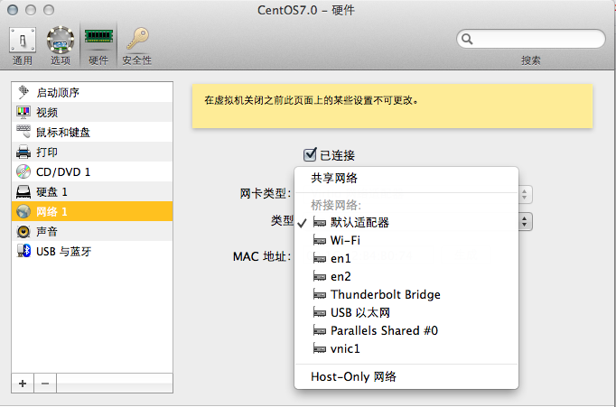
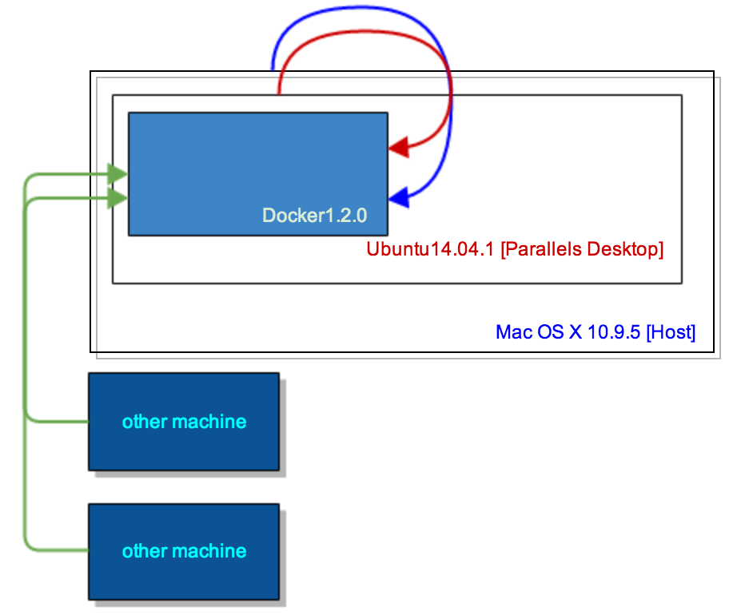
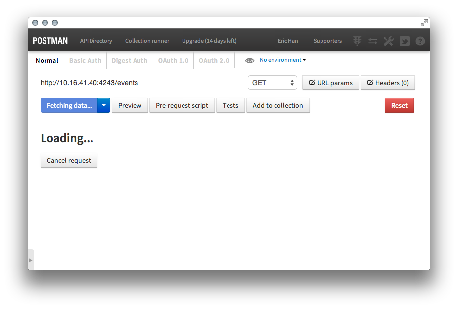

Docker远程接口
---
>[https://docs.docker.com/reference/api/docker_remote_api](https://docs.docker.com/reference/api/docker_remote_api)
>>tends to be REST

>[https://docs.docker.com/articles/basics/#bind-docker](https://docs.docker.com/articles/basics/#bind-docker)


###拓扑

####Parallel Desktop网络配置
共享网络-默认适配器


####访问拓扑
**可以从虚拟机、宿主机、同网络的其他主机访问Docker提供的remote api**



####主要角色
|角色|IP|OS|
|:--|:--|:--|
|宿主机|10.16.41.12|Mac OS X Mavericks|
|-虚拟机|10.16.41.40|Ubuntu 14.04.1; Linux 3.13.0-34|
|--Docker Daemon|172.17.42.1|Docker 1.2.0|
|其他主机|10.125.1.168|RHEL5.7|
###别名

```
alias d="sudo /usr/local/bin/docker"
alias dd = "sudo /usr/local/bin/docker -H tcp://0.0.0.0:4243 -H unix:///var/run/docker.sock -d &"
alias dc="sudo /usr/bin/docker -d -H tcp://0.0.0.0:4243 -H unix:///var/run/docker.sock >> /dev/null 2>&1 &"
```

###启动服务

```
erichan@ubuntu14_04_1-pd:~/docker-tars$ sudo service docker stop
```

```
erichan@ubuntu14_04_1-pd:~/docker-tars$ dc
[1] 4116
erichan@ubuntu14_04_1-pd:~/docker-tars$ ps aux | grep docker
root      4116  0.0  0.2  71240  2184 pts/1    S    21:31   0:00 sudo /usr/bin/docker -d -H tcp://0.0.0.0:4243 -H unix:///var/run/docker.sock
root      4117  1.0  1.0 264368 10236 pts/1    Sl   21:31   0:00 /usr/bin/docker -d -H tcp://0.0.0.0:4243 -H unix:///var/run/docker.sock
erichan   4143  0.0  0.0  15940   952 pts/1    S+   21:31   0:00 grep --color=auto docker
```

###Docker Remote API

####容器

#####List containers
```
curl -X GET http://10.16.41.40:4243/containers/json?all=1 --http1.1 | python -m json.tool
```
```
[
    {
        "Command": "/bin/sh -c /installer",
        "Created": 1408780391,
        "Id": "8ba64b90fdca0d46bfe837614b16bfb33b4b06d28b8cc38c464e3da719dfffe0",
        "Image": "jpetazzo/nsenter:latest",
        "Names": [
            "/compassionate_feynman"
        ],
        "Ports": [],
        "Status": "Exited (0) 6 hours ago"
    },
    {
        "Command": "/opt/sinopia/start.sh",
        "Created": 1408780007,
        "Id": "5b03fb519385209b08cc16c263f3819532b3defeb3b3bba952d2d654013bfec2",
        "Image": "feuyeux/ubuntu-sinopia:latest",
        "Names": [
            "/sinopia"
        ],
        "Ports": [
            {
                "PrivatePort": 22,
                "Type": "tcp"
            },
            {
                "IP": "0.0.0.0",
                "PrivatePort": 4873,
                "PublicPort": 4873,
                "Type": "tcp"
            },
            {
                "PrivatePort": 8080,
                "Type": "tcp"
            }
        ],
        "Status": "Exited (-127) 5 hours ago"
    }
]
```

#####Start/Stop a container

	curl -X POST http://10.16.41.40:4243/containers/sinopia/start 
	curl -X POST http://10.16.41.40:4243/containers/sinopia/stop
	curl -X POST http://10.16.41.40:4243/containers/sinopia/restart
	curl -X POST http://10.16.41.40:4243/containers/sinopia/kill
	curl -X POST http://10.16.41.40:4243/containers/sinopia/wait	curl -X POST http://10.16.41.40:4243/containers/sinopia/pause
	curl -X POST http://10.16.41.40:4243/containers/sinopia/unpause

#####Inspect a container
```
curl http://10.16.41.40:4243/containers/sinopia/json
```

#####Inspect changes on a container's filesystem
```
curl http://10.16.41.40:4243/containers/sinopia/changes
```

#####Attach to a container [详细](https://docs.docker.com/reference/api/docker_remote_api_v1.14/#attach-to-a-container)

```
curl -X POST --http1.1 http://10.16.41.40:4243/containers/sinopia/attach?logs=1&stream=0&stdout=1
```

####镜像

#####List Images
```GET /images/json```

#####Create an image
```POST /images/create```

#####Inspect an image
```GET /images/(name)/json```

#####Get the history of an image
```GET /images/(name)/history```

#####Push an image on the registry
```POST /images/(name)/push```

#####Tag an image into a repository
```POST /images/(name)/tag```

#####Remove an image
```DELETE /images/(name)```

#####Search images
```GET /images/search```


####其他
#####Build an image from Dockerfile via stdin
```POST /build```

#####Check auth configuration
```POST /auth```

#####Display system-wide information
```GET /info```

#####Show the docker version information
```GET /version```

#####Ping the docker server
```GET /_ping
```
#####Create a new image from a container's changes
```POST /commit```

#####Monitor Docker's events
```GET /events```

#####Load a tarball with a set of images and tags into docker
```POST /images/load```


####使用POSTMAN调试


