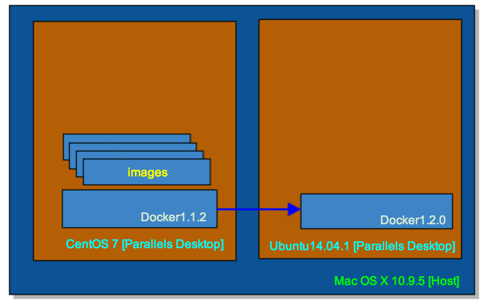

复制Docker镜像
---


###[Left side]docker save

```
nano copyall.sh

sudo /usr/local/bin/docker save -o sinopia.tar feuyeux/ubuntu-sinopia
sudo /usr/local/bin/docker save -o shipyar.tar shipyard/shipyard
sudo /usr/local/bin/docker save -o dui.tar crosbymichael/dockerui
sudo /usr/local/bin/docker save -o tomapp.tar feuyeux/tomcat-webapp
sudo /usr/local/bin/docker save -o tomcat7.tar feuyeux/ubuntu-tomcat7
sudo /usr/local/bin/docker save -o java7.tar feuyeux/ubuntu-java7
sudo /usr/local/bin/docker save -o node.tar feuyeux/ubuntu-node
sudo /usr/local/bin/docker save -o nginx.tar feuyeux/nginx
sudo /usr/local/bin/docker save -o feuyeux.tar feuyeux/ubuntu-base
sudo /usr/local/bin/docker save -o ubuntu.tar ubuntu
sudo /usr/local/bin/docker save -o golang.tar crosbymichael/golang
```

```
d save -o nsenter.tar jpetazzo/nsenter
```

```
[erichan@mars-centos7 docker-tars]$ ll
total 4645604
-rw-r--r--. 1 root root 462833664 Aug 22 10:06 dui.tar
-rw-r--r--. 1 root root 288475648 Aug 22 10:09 feuyeux.tar
-rw-r--r--. 1 root root 450134528 Aug 22 10:09 golang.tar
-rw-r--r--. 1 root root 396756480 Aug 22 10:08 java7.tar
-rw-r--r--. 1 root root 305517056 Aug 22 10:08 nginx.tar
-rw-r--r--. 1 root root 429558272 Aug 22 10:08 node.tar
-rw-r--r--. 1 root root 343750656 Aug 23 01:42 nsenter.tar
-rw-r--r--. 1 root root 667407872 Aug 22 10:06 shipyar.tar
-rw-r--r--. 1 root root 489777152 Aug 22 10:05 sinopia.tar
-rw-r--r--. 1 root root 289439744 Aug 22 10:07 tomapp.tar
-rw-r--r--. 1 root root 410928128 Aug 22 10:07 tomcat7.tar
-rw-r--r--. 1 root root 222491648 Aug 22 10:09 ubuntu.tar
```

###[Left -> Right] scp

```
[erichan@mars-centos7 docker-tars]$ scp *.tar erichan@192.168.1.12:/home/erichan/docker-tars
```

### [Left side] tree
```
[erichan@mars-centos7 docker-tars]$ d images --tree
Warning: '--tree' is deprecated, it will be removed soon. See usage.
└─511136ea3c5a Virtual Size: 0 B
  ├─a70fb0647e6e Virtual Size: 90.08 MB
  │ └─431dac4e3917 Virtual Size: 90.08 MB
  │   └─d116218e4b49 Virtual Size: 90.08 MB
  │     └─a3eb5404b603 Virtual Size: 99.08 MB
  │       └─e34bdbfac6ba Virtual Size: 296.7 MB
  │         └─6d34b4248f04 Virtual Size: 296.7 MB
  │           └─d6392754f87d Virtual Size: 296.7 MB
  │             └─d410935fdd69 Virtual Size: 325.4 MB
  │               └─fe4ba0d4eecb Virtual Size: 325.4 MB
  │                 └─2827fe959f17 Virtual Size: 325.4 MB
  │                   └─6d9b6796dae4 Virtual Size: 326.9 MB
  │                     └─879ea3e97923 Virtual Size: 330 MB
  │                       └─760dca4ac772 Virtual Size: 330.9 MB
  │                         └─1408f1699349 Virtual Size: 330.9 MB
  │                           └─0df8dc8c0f75 Virtual Size: 330.9 MB
  │                             └─278ef3eda7e4 Virtual Size: 330.9 MB Tags: jpetazzo/nsenter:latest
  ├─1c9383292a8f Virtual Size: 192.5 MB
  │ └─9942dd43ff21 Virtual Size: 192.7 MB
  │   └─d92c3c92fa73 Virtual Size: 192.7 MB
  │     └─0ea0d582fd90 Virtual Size: 192.7 MB
  │       └─cc58e55aa5a5 Virtual Size: 213 MB
  │         └─c4ff7513909d Virtual Size: 213 MB Tags: ubuntu:14.04
  │           └─84d9bc7c94f1 Virtual Size: 213 MB
  │             └─bc3f3d27ad0a Virtual Size: 232.9 MB
  │               └─5106a2f2e8e9 Virtual Size: 274.9 MB
  │                 └─6fca67db13e4 Virtual Size: 274.9 MB
  │                   └─bab456d2d9de Virtual Size: 274.9 MB
  │                     └─30fe631d9934 Virtual Size: 274.9 MB Tags: feuyeux/ubuntu-base:latest
  │                       └─799431c603a6 Virtual Size: 274.9 MB
  │                         ├─a0659dabbb00 Virtual Size: 274.9 MB
  │                         │ ├─97cb3f908a49 Virtual Size: 275.8 MB
  │                         │ │ └─aeadd8f897b7 Virtual Size: 275.8 MB
  │                         │ │   └─b5d4878f47e8 Virtual Size: 275.8 MB
  │                         │ │     └─719ec00d5753 Virtual Size: 275.8 MB
  │                         │ │       └─28b504eae62d Virtual Size: 275.8 MB
  │                         │ │         └─42acb3779a7b Virtual Size: 275.8 MB Tags: feuyeux/tomcat-webapp:latest
  │                         │ └─2f55fc4b5491 Virtual Size: 274.9 MB
  │                         │   └─f500aabc5755 Virtual Size: 275.8 MB
  │                         │     └─d85e1b92abda Virtual Size: 381.6 MB
  │                         │       └─729eaecadcf8 Virtual Size: 381.6 MB
  │                         │         └─ac5983bd6a3d Virtual Size: 381.6 MB
  │                         │           └─9a5376001883 Virtual Size: 381.6 MB Tags: feuyeux/ubuntu-java7:latest
  │                         │             └─635299d74398 Virtual Size: 381.6 MB
  │                         │               └─ec4dfa0922a3 Virtual Size: 381.6 MB
  │                         │                 └─ba5f7f0f7867 Virtual Size: 381.6 MB
  │                         │                   └─d12bb9b9d55b Virtual Size: 381.6 MB
  │                         │                     └─43c0e1ddfa9b Virtual Size: 395.2 MB
  │                         │                       └─45906322d8c8 Virtual Size: 395.2 MB
  │                         │                         └─b7a556660b8d Virtual Size: 395.2 MB
  │                         │                           └─3956be63f8b2 Virtual Size: 395.2 MB Tags: feuyeux/ubuntu-tomcat7:latest
  │                         ├─718c01f77709 Virtual Size: 283.3 MB
  │                         │ └─6db67bad7a06 Virtual Size: 398.7 MB
  │                         │   └─3e22218eefc1 Virtual Size: 398.7 MB
  │                         │     └─8e69e9edee5d Virtual Size: 398.7 MB
  │                         │       └─6014d3e09f30 Virtual Size: 408.2 MB
  │                         │         └─08f9e2a9f55d Virtual Size: 408.2 MB
  │                         │           └─7eb4cbfcf2e0 Virtual Size: 408.2 MB Tags: feuyeux/ubuntu-node:latest
  │                         │             └─bd62d7c3611c Virtual Size: 408.2 MB
  │                         │               └─c960e53c1b40 Virtual Size: 448 MB
  │                         │                 └─78689f6f2b39 Virtual Size: 465.2 MB
  │                         │                   └─8db99c03a2ca Virtual Size: 465.5 MB
  │                         │                     └─7dadbc492b3c Virtual Size: 465.5 MB
  │                         │                       └─fec3907ca6c9 Virtual Size: 465.5 MB
  │                         │                         └─e9edc497b77e Virtual Size: 465.5 MB
  │                         │                           └─0b7bda3426ed Virtual Size: 465.5 MB
  │                         │                             └─25770258cbb3 Virtual Size: 465.5 MB
  │                         │                               └─b7ca2de9de54 Virtual Size: 465.5 MB
  │                         │                                 └─98608ce66f2e Virtual Size: 465.5 MB
  │                         │                                   └─d726fece57ac Virtual Size: 465.5 MB Tags: feuyeux/ubuntu-sinopia:latest
  │                         └─dcb26454f7d0 Virtual Size: 276.2 MB
  │                           └─508ff111bb29 Virtual Size: 291.6 MB
  │                             └─edcbcb4b01a3 Virtual Size: 291.6 MB
  │                               └─4f5a08f21d89 Virtual Size: 291.6 MB
  │                                 └─9fd1d35c43bc Virtual Size: 291.6 MB
  │                                   └─7f1df0dc6e46 Virtual Size: 291.6 MB Tags: feuyeux/nginx:1.0
  ├─eda83c773872 Virtual Size: 89.41 MB
  │ └─3593263a3873 Virtual Size: 89.41 MB
  │   ├─9a980b0c169f Virtual Size: 116.2 MB
  │   │ └─8115b7fc61a5 Virtual Size: 116.2 MB
  │   │   └─26f38df22a14 Virtual Size: 116.2 MB
  │   │     └─3b99eabddb7c Virtual Size: 116.2 MB
  │   │       └─e7f1b39e6022 Virtual Size: 116.2 MB Tags: shipyard/shipyard:beta
  │   └─1de758bde7b3 Virtual Size: 239.5 MB
  │     └─0bcc9c7867e0 Virtual Size: 436.3 MB
  │       └─4ca03f87f495 Virtual Size: 436.3 MB
  │         └─e03fdb784537 Virtual Size: 436.3 MB
  │           └─7b0c5233869f Virtual Size: 436.3 MB Tags: crosbymichael/golang:latest
  │             └─46e952f11985 Virtual Size: 442.8 MB
  │               └─b1ac069452f7 Virtual Size: 442.8 MB
  │                 └─107341eefedd Virtual Size: 448.7 MB
  │                   └─ad2d0900adc4 Virtual Size: 448.7 MB
  │                     └─488181b9ffaa Virtual Size: 448.7 MB Tags: crosbymichael/dockerui:latest
  └─b74728ce6435 Virtual Size: 0 B
    └─3aa646e4f1d2 Virtual Size: 126.2 MB
      └─3460b1ba3f7d Virtual Size: 126.2 MB
        └─a5ecfcb0c3ab Virtual Size: 205.5 MB
          └─e9ea2cf75457 Virtual Size: 466.4 MB
            └─a99fc8317095 Virtual Size: 466.4 MB
              └─bcc03731b14a Virtual Size: 472.8 MB
                └─097fa19d68a3 Virtual Size: 474.2 MB
                  └─d8cee5a45c55 Virtual Size: 475.4 MB
                    └─ee6e40ca2eb3 Virtual Size: 475.7 MB
                      └─979fadd1e0e4 Virtual Size: 477.3 MB
                        └─f7c1c56aae88 Virtual Size: 480.2 MB
                          └─94c09324fa29 Virtual Size: 480.2 MB
                            └─874c1149f830 Virtual Size: 480.2 MB
                              └─8ad2b9213170 Virtual Size: 516 MB
                                └─5b18c104c09f Virtual Size: 516.1 MB
                                  └─d7b96d16df63 Virtual Size: 516.3 MB
                                    └─cd1bd7a9e8c2 Virtual Size: 516.3 MB
                                      └─eba9b5f1d1d1 Virtual Size: 516.3 MB
                                        └─08852c160ec2 Virtual Size: 516.3 MB
                                          └─2cbf6e5024d8 Virtual Size: 516.3 MB
                                            └─30e0b59613ff Virtual Size: 516.3 MB Tags: shipyard/shipyard:latest
```

###[Right side] docker load
```
erichan@ubuntu14_04_1-pd:~/docker-tars$ d load -i sinopia.tar

erichan@ubuntu14_04_1-pd:~/docker-tars$ d images
REPOSITORY               TAG                 IMAGE ID            CREATED             VIRTUAL SIZE
feuyeux/ubuntu-sinopia   latest              d726fece57ac        2 days ago          465.5 MB
```

###[Right side] tree
```
erichan@ubuntu14_04_1-pd:~/docker-tars$ d images --tree
Warning: '--tree' is deprecated, it will be removed soon. See usage.
└─511136ea3c5a Virtual Size: 0 B
  └─1c9383292a8f Virtual Size: 192.5 MB
    └─9942dd43ff21 Virtual Size: 192.7 MB
      └─d92c3c92fa73 Virtual Size: 192.7 MB
        └─0ea0d582fd90 Virtual Size: 192.7 MB
          └─cc58e55aa5a5 Virtual Size: 213 MB
            └─c4ff7513909d Virtual Size: 213 MB
              └─84d9bc7c94f1 Virtual Size: 213 MB
                └─bc3f3d27ad0a Virtual Size: 232.9 MB
                  └─5106a2f2e8e9 Virtual Size: 274.9 MB
                    └─6fca67db13e4 Virtual Size: 274.9 MB
                      └─bab456d2d9de Virtual Size: 274.9 MB
                        └─30fe631d9934 Virtual Size: 274.9 MB
                          └─799431c603a6 Virtual Size: 274.9 MB
                            └─718c01f77709 Virtual Size: 283.3 MB
                              └─6db67bad7a06 Virtual Size: 398.7 MB
                                └─3e22218eefc1 Virtual Size: 398.7 MB
                                  └─8e69e9edee5d Virtual Size: 398.7 MB
                                    └─6014d3e09f30 Virtual Size: 408.2 MB
                                      └─08f9e2a9f55d Virtual Size: 408.2 MB
                                        └─7eb4cbfcf2e0 Virtual Size: 408.2 MB
                                          └─bd62d7c3611c Virtual Size: 408.2 MB
                                            └─c960e53c1b40 Virtual Size: 448 MB
                                              └─78689f6f2b39 Virtual Size: 465.2 MB
                                                └─8db99c03a2ca Virtual Size: 465.5 MB
                                                  └─7dadbc492b3c Virtual Size: 465.5 MB
                                                    └─fec3907ca6c9 Virtual Size: 465.5 MB
                                                      └─e9edc497b77e Virtual Size: 465.5 MB
                                                        └─0b7bda3426ed Virtual Size: 465.5 MB
                                                          └─25770258cbb3 Virtual Size: 465.5 MB
                                                            └─b7ca2de9de54 Virtual Size: 465.5 MB
                                                              └─98608ce66f2e Virtual Size: 465.5 MB
                                                                └─d726fece57ac Virtual Size: 465.5 MB Tags: feuyeux/ubuntu-sinopia:latest

```

