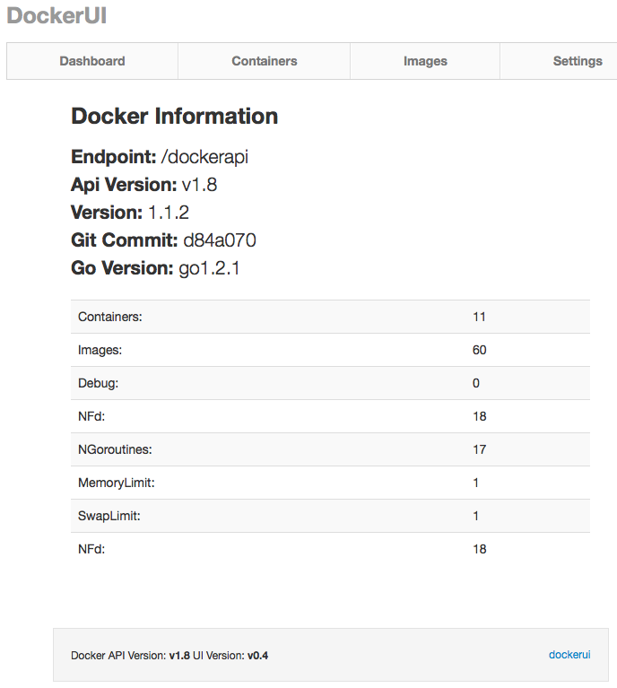

图形化Docker·dockerui
---
>官方地址：[https://github.com/crosbymichael/dockerui](https://github.com/crosbymichael/dockerui)

###远程构建镜像
```
[erichan@mars-centos7 docker-room]$ d build -t crosbymichael/dockerui github.com/crosbymichael/dockerui
Sending build context to Docker daemon 6.722 MB
Sending build context to Docker daemon 
Step 0 : FROM crosbymichael/golang
 ---> 7b0c5233869f
Step 1 : ADD . /app/
 ---> 46e952f11985
Removing intermediate container 17127e94c09d
Step 2 : WORKDIR /app/
 ---> Running in b40fa21935d5
 ---> b1ac069452f7
Removing intermediate container b40fa21935d5
Step 3 : RUN go build dockerui.go
 ---> Running in c3407af693e4
 ---> 107341eefedd
Removing intermediate container c3407af693e4
Step 4 : EXPOSE 9000
 ---> Running in 9288042e074e
 ---> ad2d0900adc4
Removing intermediate container 9288042e074e
Step 5 : ENTRYPOINT ["./dockerui"]
 ---> Running in 9a119d8f9db3
 ---> 488181b9ffaa
Removing intermediate container 9a119d8f9db3
Successfully built 488181b9ffaa
```

###检查镜像
```
[erichan@mars-centos7 docker-room]$ d images
REPOSITORY               TAG                 IMAGE ID            CREATED             VIRTUAL SIZE
crosbymichael/dockerui   latest              488181b9ffaa        5 minutes ago       448.7 MB
crosbymichael/golang     latest              7b0c5233869f        4 weeks ago         436.3 MB
```

###启动dockerui容器
```
d run -d -p 9000:9000 -v /var/run/docker.sock:/docker.sock crosbymichael/dockerui -e /docker.sock
```

###测试dockerui
```
http://10.211.55.14:9000
```

