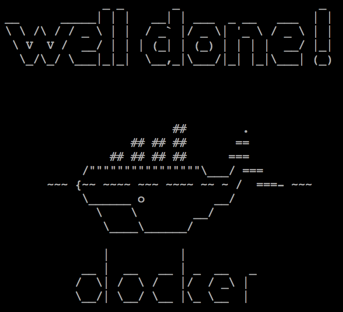

Docker101
---

###Docker是什么
[翻译自 whatisdocker](https://www.docker.com/whatisdocker/)

>Docker is an open platform for developers and sysadmins to build, ship, and run distributed applications. Consisting of Docker Engine, a portable, lightweight runtime and packaging tool, and Docker Hub, a cloud service for sharing applications and automating workflows, Docker enables apps to be quickly assembled from components and eliminates the friction between development, QA, and production environments. As a result, IT can ship faster and run the same app, unchanged, on laptops, data center VMs, and any cloud.

Docker是一个开源平台，使开发者和系统管理员可以构建、发布和运行分布式应用。Docker包括Docker引擎、可移植的轻量级运行环境和打包工具，Docker Hub提供了分享应用和自动化工作流的云服务，Docker可以使应用由多个组件快速装配起来，消除了开发、测试和生产环境的差异。因此，IT可以更快地发布，运行在笔记本、数据中心虚拟设备和任何云端，无需更改任何配置。

####为啥开发者喜爱Docker
>With Docker, developers can build any app in any language using any toolchain. “Dockerized” apps are completely portable and can run anywhere - colleagues’ OS X and Windows laptops, QA servers running Ubuntu in the cloud, and production data center VMs running Red Hat.

使用Docker，开发中可以在任何语言中使用任何工具链构建任何应用。Docker化的应用是完全可移植的，可以运行在任何地方，比如旁边同学的Mac机和Windows笔记本上、云端的Ubuntu系统上运行的QA服务器上，以及Red Hat上运行的数据中心虚拟机上。

>Developers can get going quickly by starting with one of the 13,000+ apps available on Docker Hub. Docker manages and tracks changes and dependencies, making it easier for sysadmins to understand how the apps that developers build work. And with Docker Hub, developers can automate their build pipeline and share artifacts with collaborators through public or private repositories.

开发者可以从Docker Hub上13,000+个可用的应用，快速开始。Docker管理和跟踪修订和依赖，使系统管理员很容易理解开发者的构建工作。使用Docker Hub，开发者可以自动化他们的构建管道，通过公有或者私有仓库与合作者分享工件。

>Docker helps developers build and ship higher-quality applications, faster.

Docker让开发者可以更快地构建和发布更高质量的应用。


####为啥系统管理员喜爱Docker
>Sysadmins use Docker to provide standardized environments for their development, QA, and production teams, reducing “works on my machine” finger-pointing. By “Dockerizing” the app platform and its dependencies, sysadmins abstract away differences in OS distributions and underlying infrastructure.

系统管理员使用Docker为开发、测试和生产团队提供了标准环境，降低了“在我这儿好使啊”的纷争。系统管理员通过Docker化应用平台及其依赖，抽象了操作系统和底层基础架构的差异。

>In addition, standardizing on the Docker Engine as the unit of deployment gives sysadmins flexibility in where workloads run. Whether on-premise bare metal or data center VMs or public clouds, workload deployment is less constrained by infrastructure technology and is instead driven by business priorities and policies. Furthermore, the Docker Engine’s lightweight runtime enables rapid scale-up and scale-down in response to changes in demand.

此外，标准化Docker引擎为部署单元为系统管理员提供了运行负载中的灵活性。部署到预置的裸机、数据中心虚拟机或者公有云的考量，很少是基础架构技术，而是由业务优先级和策略驱动的。而且，Docker引擎的轻量级运行时可以快速按需响应扩容或缩容的变更。

>Docker helps sysadmins deploy and run any app on any infrastructure, quickly and reliably.

Docker让系统管理员可以快速、可靠地部署和运行任何基础架构上的任何应用。

####Docker和VM有啥不同
#####虚拟机（VM）
>Each virtualized application includes not only the application - which may be only 10s of MB - and the necessary binaries and libraries, but also an entire guest operating system - which may weigh 10s of GB.

每个虚拟化的应用不仅包含应用本身（10几MB而已）和必要的二进制文件和包，还包括整个客户机操作系统（个头有10几GB）。
#####Docker
>The Docker Engine container comprises just the application and its dependencies. It runs as an isolated process in userspace on the host operating system, sharing the kernel with other containers. Thus, it enjoys the resource isolation and allocation benefits of VMs but is much more portable and efficient.

Docker引擎容器只包含应用及其依赖。Docker作为宿主操作系统上用户空间中一个隔离的进程运行，与其他容器共享操作系统内核。因此，资源隔离和分配比VM强大，而且可移植性和效率更好。

###试一试Docker
来自 [gettingstarted](https://www.docker.io/gettingstarted/) 和 [tryit](http://www.docker.com/tryit/#)

这是Docker官方提供的傻瓜入门指导，包括9个步骤、0-8个阶段。

####第0阶段
>Step0
Docker Engine parts
The Docker Engine consists of two parts: a daemon, a server process that manages all the containers, and a client, which acts as a remote control for the daemon.
Assignment
Check which version of Docker is running. This will verify that the daemon is running and that you can connect to it. If you can see the version number you know you are all set.

- Docker引擎
- Docker引擎包括一个守护进程和一个管理所有容器、客户端的服务进程。
- 第0步的任务是查看Docker版本，这一过程会检查daemon的守护进程是否运行。

```
you@tutorial:~$ docker version
Docker Emulator version 0.1.3
 
Emulating:
Client version: 0.5.3
Server version: 0.5.3
Go version: go1.1
```

这个练习环境的Docker版本很低，目前Docker的版本已经是1.0.x，1.1正在酝酿中。我们可以看到，Docker本身依赖go语言环境。

####第1阶段
>Step1
Searching for images
The easiest way to get started is to use a container image from someone else. Container images are available on the Docker Hub Registry, a cloud-based collection of applications. You can find them online at Docker Hub as well through the Docker Engine client command line.
Assignment
Use the command line to search for an image called "tutorial".

- 查找镜像
- 最简单的开始方式是使用从别人那拿到的容器镜像。容器镜像是在Docker Hub Registry上可用的，Docker Hub是一个基于云的应用集合。在终端使用Docker命令可以查找到这些镜像。
- 第1步的任务是查找名为“tutorial”的镜像。

```
you@tutorial:~$ docker search tutorial
Found 1 results matching your query ("tutorial")
NAME                      DESCRIPTION
learn/tutorial            An image for the interactive tutorial
```

通过docker search，我们找到的镜像名称为learn/tutorial。


####第2阶段>Step2
Downloading container images
Container images can be downloaded easily using docker pull. For images in the Docker Hub Registry, the name you specify is constructed as <username>/<repository>.
Assignment
Please download the tutorial image you have just found.

- 下载镜像
- 容器镜像可以通过docker pull下载，指定的名称结构为：用户名/仓库名。
- 第2步的任务是下载tutorial镜像。

```
you@tutorial:~$ docker pull learn/tutorial
Pulling repository learn/tutorial from https://index.docker.io/v1
Pulling image 8dbd9e392a964056420e5d58ca5cc376ef18e2de93b5cc90e868a1bbc8318c1c (precise) from ubuntu
Pulling image b750fe79269d2ec9a3c593ef05b4332b1d1a02a62b4accb2c21d589ff2f5f2dc (12.10) from ubuntu
Pulling image 27cf784147099545 () from tutorial
```

从docker pull的执行过程输出可以看到，镜像是从https://index.docker.io/v1拉下来的。该镜像的OS是ubuntu12.10，版本12.10的代号为precise。拉下来的镜像编号为27cf784147099545。

####第3阶段
>Step3
Hello world
You can think of containers as a process in a box. The box contains everything the process might need, so it has the filesystem, system libraries, shell and such, but by default none of these are running. You 'start' a container by running a process in it.
Assignment
Run the downloaded image and have it output "hello world". To do so you should run 'echo' in the container and have that say "hello world”.

- 容器可以看做是Docker box中的进程。box包含进程所需的全部，包括文件系统、系统库、shell等，默认情况下，这些都不运行。
- 第3步的任务是让镜像运行输出“hello world”。

```
you@tutorial:~$ docker run learn/tutorial echo 'hello world'
'hello world'
```

####第4阶段
>Step4
installing things
Next we are going to install a simple utility, ping, in the container. The image is based upon ubuntu, so you can run the command apt-get install -y ping in the container. Note that even though the container stops right after a command completes, the changes are not forgotten.
Assignment
Run the downloaded image and have it output install 'ping' on top of the learn/tutorial image.

- 安装软件到容器
- 第4步的任务是安装ping这个工具，在ubuntu中，使用apt-get install可以横扫一切安装包，-y是静默安装参数，这是自动化配管所需的。

```
you@tutorial:~$ docker run learn/tutorial apt-get install -y ping
Reading package lists...
Building dependency tree...
The following NEW packages will be installed:
  iputils-ping
0 upgraded, 1 newly installed, 0 to remove and 0 not upgraded.
Need to get 56.1 kB of archives.
After this operation, 143 kB of additional disk space will be used.
Get:1 http://archive.ubuntu.com/ubuntu/ precise/main iputils-ping amd64 3:20101006-1ubuntu1 [56.1 kB]
debconf: delaying package configuration, since apt-utils is not installed
Fetched 56.1 kB in 1s (50.3 kB/s)
Selecting previously unselected package iputils-ping.
(Reading database ... 7545 files and directories currently installed.)
Unpacking iputils-ping (from .../iputils-ping_3%3a20101006-1ubuntu1_amd64.deb) ...
Setting up iputils-ping (3:20101006-1ubuntu1) ...
```

iputils-ping这个工具包只有56.1kB。


####第5阶段
>Step5
Save your changes
After you make changes (by running a command inside a container), you probably want to save those changes. This will enable you to start from this point later. With Docker, the process of saving the state is called committing. Commit basically saves the difference between the old image and the new state.
Assignment
First use docker ps -l to find the ID of the container you created by installing ping. Then save (commit) this container with the repository name 'learn/ping'.

- 保存变更到镜像
- 当前的系统状态可以作为日后的基准点，通过Docker的commit命令可以将当前状态保存下来，提交的内容包括旧的镜像和新的状态。
- 第5步的任务是使用docker ps -l获取安装ping的那个容器的进程ID，使用“learn/ping”作为仓库名提交。

```
you@tutorial:~$ docker ps -l
ID                  IMAGE               COMMAND                CREATED             STATUS              PORTS
6982a9948422        ubuntu:12.04        apt-get install ping   1 minute ago        Exit 0
you@tutorial:~$ docker commit 6982a 'learn/ping'
effb66b31edb
```

docker ps -l展示的是进程ID的hashcode，和git等一样，Docker的commit参数可以使用ID的hashcode前5位来简化标识。

####第6阶段
>Step6
Run your new image
You have built a complete, self-contained image with the 'ping' utility installed. Your image can now run on any host that runs Docker. Let's try it now.
Assignment
Run the ping program to ping www.google.com.

- 运行新镜像
- 构建完带有ping工具的镜像后，该镜像即可被运行。
- 第6步的任务是运行该镜像，使用其中的ping来ping google。

```
you@tutorial:~$ docker run learn/ping ping www.google.com
PING www.google.com (74.125.239.129) 56(84) bytes of data.
64 bytes from nuq05s02-in-f20.1e100.net (74.125.239.148): icmp_req=1 ttl=55 time=2.23 ms
```

这个练习环境不支持Ctrl+C，但是它会自己停下来。

####第7阶段
>Step7
Check your container
Your image is now a running container. Using docker ps we can see a list of all running containers, and using docker inspect. We can see useful information about this container.
Assignment
Find the container ID of the running container, and then inspect the container using docker inspect.

- 检查容器
- 使用docker ps可以获得运行的容器列表，使用docker inspect可以获取某个容器的有用信息。
- 第7步的任务是查询容器ID并审查容器信息。

```
you@tutorial:~$ docker ps
ID                  IMAGE               COMMAND               CREATED             STATUS              PORTS
efefdc74a1d5        learn/ping:latest   ping www.google.com   37 seconds ago      Up 36 seconds
you@tutorial:~$ docker inspect efefd
[2013/07/30 01:52:26 GET /v1.3/containers/efef/json
{
  "ID": "efefdc74a1d5900d7d7a74740e5261c09f5f42b6dae58ded6a1fde1cde7f4ac5",
  "Created": "2013-07-30T00:54:12.417119736Z",
  "Path": "ping",
  "Args": [
      "www.google.com"
  ],
  "Config": {
      "Hostname": "efefdc74a1d5",
      "User": "",
      "Memory": 0,
      "MemorySwap": 0,
      "CpuShares": 0,
      "AttachStdin": false,
      "AttachStdout": true,
      "AttachStderr": true,
      "PortSpecs": null,
      "Tty": false,
      "OpenStdin": false,
      "StdinOnce": false,
      "Env": null,
      "Cmd": [
          "ping",
          "www.google.com"
      ],
      "Dns": null,
      "Image": "learn/ping",
      "Volumes": null,
      "VolumesFrom": "",
      "Entrypoint": null
  },
  "State": {
      "Running": true,
      "Pid": 22249,
      "ExitCode": 0,
      "StartedAt": "2013-07-30T00:54:12.424817715Z",
      "Ghost": false
  },
  "Image": "a1dbb48ce764c6651f5af98b46ed052a5f751233d731b645a6c57f91a4cb7158",
  "NetworkSettings": {
      "IPAddress": "172.16.42.6",
      "IPPrefixLen": 24,
      "Gateway": "172.16.42.1",
      "Bridge": "docker0",
      "PortMapping": {
          "Tcp": {},
          "Udp": {}
      }
  },
  "SysInitPath": "/usr/bin/docker",
  "ResolvConfPath": "/etc/resolv.conf",
  "Volumes": {},
  "VolumesRW": {}
```

####第8阶段
>Step8
Push your image to the Docker Hub Registry
Now that you have verified that your image works, you can share it with others. Remember that you pulled (downloaded) the learn/tutorial image from the Registry? By pushing (uploading) images that you build, you can easily retrieve them to use on other hosts as well as share them with other users.
Assignment
Push your learn/ping image to the Registry.

- 提交镜像到Docker Hub Registry
- 第8步的任务是提交learn/ping这个容器到Registry。

```
you@tutorial:~$ docker push learn/ping
The push refers to a repository [learn/ping] (len: 1)
Processing checksums
Sending image list
Pushing repository learn/ping (1 tags)
Pushing 8dbd9e392a964056420e5d58ca5cc376ef18e2de93b5cc90e868a1bbc8318c1c
Image 8dbd9e392a964056420e5d58ca5cc376ef18e2de93b5cc90e868a1bbc8318c1c already pushed, skipping
Pushing tags for rev [8dbd9e392a964056420e5d58ca5cc376ef18e2de93b5cc90e868a1bbc8318c1c] on {https://registry-1.docker.io/v1/repositories/learn/pin
g/tags/latest}
Pushing a1dbb48ce764c6651f5af98b46ed052a5f751233d731b645a6c57f91a4cb7158
Pushing  11.5 MB/11.5 MB (100%)
Pushing tags for rev [a1dbb48ce764c6651f5af98b46ed052a5f751233d731b645a6c57f91a4cb7158] on {https://registry-1.docker.io/v1/repositories/learn/pin
g/tags/latest}
```

改容器只有11.5MB的大小。

傻瓜式教学在如下输出后结束。



到此Docker101结束。 

[返回主页面](/README.md)