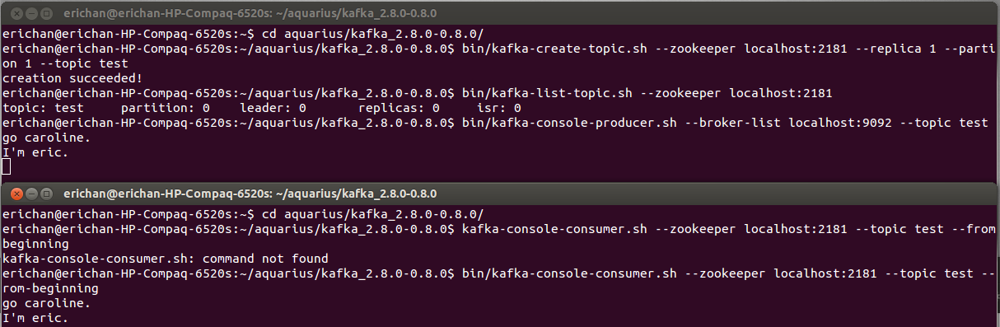

## kafka first step ##

- [quickstart](http://kafka.apache.org/documentation.html#quickstart)
- [Kafka分布式环境搭建](http://my.oschina.net/ielts0909/blog/93190)

#### sbt ####
[sbt](http://www.scala-sbt.org/) is a build tool for Scala, Java, and more. It requires Java 1.6 or later.

#### ./sbt update ####
	erichan@erichan-HP-Compaq-6520s:~/aquarius/kafka_2.8.0-0.8.0$ sbt update
	Loading /usr/share/sbt/bin/sbt-launch-lib.bash
	Getting org.scala-sbt sbt 0.13.1 ...
	downloading http://repo.typesafe.com/typesafe/ivy-releases/org.scala-sbt/sbt/0.13.1/jars/sbt.jar ...
	[SUCCESSFUL ] org.scala-sbt#sbt;0.13.1!sbt.jar (3435ms)
	downloading http://repo1.maven.org/maven2/org/scala-lang/scala-library/2.10.3/scala-library-2.10.3.jar ...
	[SUCCESSFUL ] org.scala-lang#scala-library;2.10.3!scala-library.jar (58358ms)
	downloading http://repo.typesafe.com/typesafe/ivy-releases/org.scala-sbt/main/0.13.1/jars/main.jar ...
	[SUCCESSFUL ] org.scala-sbt#main;0.13.1!main.jar (95717ms)
	downloading http://repo.typesafe.com/typesafe/ivy-releases/org.scala-sbt/compiler-interface/0.13.1/jars/compiler-interface-bin.jar ...
	[SUCCESSFUL ] org.scala-sbt#compiler-interface;0.13.1!compiler-interface-bin.jar (8166ms)
	downloading http://repo.typesafe.com/typesafe/ivy-releases/org.scala-sbt/compiler-interface/0.13.1/jars/compiler-interface-src.jar ...
	[SUCCESSFUL ] org.scala-sbt#compiler-interface;0.13.1!compiler-interface-src.jar (3835ms)
	downloading http://repo.typesafe.com/typesafe/ivy-releases/org.scala-sbt/precompiled-2_8_2/0.13.1/jars/compiler-interface-bin.jar ...
	[SUCCESSFUL ] org.scala-sbt#precompiled-2_8_2;0.13.1!compiler-interface-bin.jar (18864ms)
	downloading http://repo.typesafe.com/typesafe/ivy-releases/org.scala-sbt/precompiled-2_9_2/0.13.1/jars/compiler-interface-bin.jar ...
	[SUCCESSFUL ] org.scala-sbt#precompiled-2_9_2;0.13.1!compiler-interface-bin.jar (16376ms)
	downloading http://repo.typesafe.com/typesafe/ivy-releases/org.scala-sbt/precompiled-2_9_3/0.13.1/jars/compiler-interface-bin.jar ...
	[SUCCESSFUL ] org.scala-sbt#precompiled-2_9_3;0.13.1!compiler-interface-bin.jar (9832ms)
	downloading http://repo.typesafe.com/typesafe/ivy-releases/org.scala-sbt/actions/0.13.1/jars/actions.jar ...
	[SUCCESSFUL ] org.scala-sbt#actions;0.13.1!actions.jar (16864ms)
	downloading http://repo.typesafe.com/typesafe/ivy-releases/org.scala-sbt/main-settings/0.13.1/jars/main-settings.jar ...
	[SUCCESSFUL ] org.scala-sbt#main-settings;0.13.1!main-settings.jar (38948ms)
	downloading http://repo.typesafe.com/typesafe/ivy-releases/org.scala-sbt/interface/0.13.1/jars/interface.jar ...
	[SUCCESSFUL ] org.scala-sbt#interface;0.13.1!interface.jar (3977ms)
	downloading http://repo.typesafe.com/typesafe/ivy-releases/org.scala-sbt/io/0.13.1/jars/io.jar ...
	[SUCCESSFUL ] org.scala-sbt#io;0.13.1!io.jar (10659ms)
	downloading http://repo.typesafe.com/typesafe/ivy-releases/org.scala-sbt/ivy/0.13.1/jars/ivy.jar ...
	[SUCCESSFUL ] org.scala-sbt#ivy;0.13.1!ivy.jar (19224ms)
	downloading http://repo.typesafe.com/typesafe/ivy-releases/org.scala-sbt/launcher-interface/0.13.1/jars/launcher-interface.jar ...
	[SUCCESSFUL ] org.scala-sbt#launcher-interface;0.13.1!launcher-interface.jar (2450ms)
	downloading http://repo.typesafe.com/typesafe/ivy-releases/org.scala-sbt/logging/0.13.1/jars/logging.jar ...
	[SUCCESSFUL ] org.scala-sbt#logging;0.13.1!logging.jar (5047ms)
	downloading http://repo.typesafe.com/typesafe/ivy-releases/org.scala-sbt/process/0.13.1/jars/process.jar ...
	[SUCCESSFUL ] org.scala-sbt#process;0.13.1!process.jar (14442ms)
	downloading http://repo.typesafe.com/typesafe/ivy-releases/org.scala-sbt/run/0.13.1/jars/run.jar ...
	[SUCCESSFUL ] org.scala-sbt#run;0.13.1!run.jar (8934ms)
	downloading http://repo.typesafe.com/typesafe/ivy-releases/org.scala-sbt/command/0.13.1/jars/command.jar ...
	[SUCCESSFUL ] org.scala-sbt#command;0.13.1!command.jar (8792ms)
	downloading http://repo.typesafe.com/typesafe/ivy-releases/org.scala-sbt/classpath/0.13.1/jars/classpath.jar ...
	[SUCCESSFUL ] org.scala-sbt#classpath;0.13.1!classpath.jar (4332ms)
	downloading http://repo.typesafe.com/typesafe/ivy-releases/org.scala-sbt/completion/0.13.1/jars/completion.jar ...
	[SUCCESSFUL ] org.scala-sbt#completion;0.13.1!completion.jar (16619ms)
	downloading http://repo.typesafe.com/typesafe/ivy-releases/org.scala-sbt/api/0.13.1/jars/api.jar ...
	[SUCCESSFUL ] org.scala-sbt#api;0.13.1!api.jar (7813ms)
	downloading http://repo.typesafe.com/typesafe/ivy-releases/org.scala-sbt/compiler-integration/0.13.1/jars/compiler-integration.jar ...
	[SUCCESSFUL ] org.scala-sbt#compiler-integration;0.13.1!compiler-integration.jar (5193ms)
	downloading http://repo.typesafe.com/typesafe/ivy-releases/org.scala-sbt/compiler-ivy-integration/0.13.1/jars/compiler-ivy-integration.jar ...
	[SUCCESSFUL ] org.scala-sbt#compiler-ivy-integration;0.13.1!compiler-ivy-integration.jar (2925ms)
	downloading http://repo.typesafe.com/typesafe/ivy-releases/org.scala-sbt/relation/0.13.1/jars/relation.jar ...
	[SUCCESSFUL ] org.scala-sbt#relation;0.13.1!relation.jar (4895ms)
	downloading http://repo.typesafe.com/typesafe/ivy-releases/org.scala-sbt/task-system/0.13.1/jars/task-system.jar ...
	[SUCCESSFUL ] org.scala-sbt#task-system;0.13.1!task-system.jar (14210ms)
	downloading http://repo.typesafe.com/typesafe/ivy-releases/org.scala-sbt/tasks/0.13.1/jars/tasks.jar ...
	[SUCCESSFUL ] org.scala-sbt#tasks;0.13.1!tasks.jar (9063ms)
	downloading http://repo.typesafe.com/typesafe/ivy-releases/org.scala-sbt/tracking/0.13.1/jars/tracking.jar ...
	[SUCCESSFUL ] org.scala-sbt#tracking;0.13.1!tracking.jar (3475ms)
	downloading http://repo.typesafe.com/typesafe/ivy-releases/org.scala-sbt/testing/0.13.1/jars/testing.jar ...
	[SUCCESSFUL ] org.scala-sbt#testing;0.13.1!testing.jar (3950ms)
	downloading http://repo1.maven.org/maven2/org/scala-lang/scala-compiler/2.10.3/scala-compiler-2.10.3.jar ...
	
	[SUCCESSFUL ] org.scala-lang#scala-compiler;2.10.3!scala-compiler.jar (616107ms)
	downloading http://repo1.maven.org/maven2/org/scala-lang/scala-reflect/2.10.3/scala-reflect-2.10.3.jar ...
	[SUCCESSFUL ] org.scala-lang#scala-reflect;2.10.3!scala-reflect.jar (189531ms)
	downloading http://repo.typesafe.com/typesafe/ivy-releases/org.scala-sbt/control/0.13.1/jars/control.jar ...
	[SUCCESSFUL ] org.scala-sbt#control;0.13.1!control.jar (3595ms)
	downloading http://repo.typesafe.com/typesafe/ivy-releases/org.scala-sbt/collections/0.13.1/jars/collections.jar ...
	[SUCCESSFUL ] org.scala-sbt#collections;0.13.1!collections.jar (15315ms)
	downloading http://repo1.maven.org/maven2/jline/jline/2.11/jline-2.11.jar ...
	[SUCCESSFUL ] jline#jline;2.11!jline.jar (2940ms)
	downloading http://repo.typesafe.com/typesafe/ivy-releases/org.scala-sbt/incremental-compiler/0.13.1/jars/incremental-compiler.jar ...
	[SUCCESSFUL ] org.scala-sbt#incremental-compiler;0.13.1!incremental-compiler.jar (15079ms)
	downloading http://repo.typesafe.com/typesafe/ivy-releases/org.scala-sbt/compile/0.13.1/jars/compile.jar ...
	[SUCCESSFUL ] org.scala-sbt#compile;0.13.1!compile.jar (8537ms)
	downloading http://repo.typesafe.com/typesafe/ivy-releases/org.scala-sbt/persist/0.13.1/jars/persist.jar ...
	[SUCCESSFUL ] org.scala-sbt#persist;0.13.1!persist.jar (8578ms)
	downloading http://repo.typesafe.com/typesafe/ivy-releases/org.scala-sbt/classfile/0.13.1/jars/classfile.jar ...
	[SUCCESSFUL ] org.scala-sbt#classfile;0.13.1!classfile.jar (4740ms)
	downloading http://repo.typesafe.com/typesafe/ivy-releases/org.scala-tools.sbinary/sbinary_2.10/0.4.2/jars/sbinary_2.10.jar ...
	[SUCCESSFUL ] org.scala-tools.sbinary#sbinary_2.10;0.4.2!sbinary_2.10.jar (10290ms)
	downloading http://repo.typesafe.com/typesafe/ivy-releases/org.scala-sbt/cross/0.13.1/jars/cross.jar ...
	[SUCCESSFUL ] org.scala-sbt#cross;0.13.1!cross.jar (2453ms)
	downloading http://repo1.maven.org/maven2/org/apache/ivy/ivy/2.3.0-rc1/ivy-2.3.0-rc1.jar ...
	[SUCCESSFUL ] org.apache.ivy#ivy;2.3.0-rc1!ivy.jar (4577ms)
	downloading http://repo1.maven.org/maven2/com/jcraft/jsch/0.1.46/jsch-0.1.46.jar ...
	[SUCCESSFUL ] com.jcraft#jsch;0.1.46!jsch.jar (3331ms)
	downloading http://repo.typesafe.com/typesafe/ivy-releases/org.scala-sbt/cache/0.13.1/jars/cache.jar ...
	[SUCCESSFUL ] org.scala-sbt#cache;0.13.1!cache.jar (4261ms)
	downloading http://repo.typesafe.com/typesafe/ivy-releases/org.scala-sbt/test-agent/0.13.1/jars/test-agent.jar ...
	[SUCCESSFUL ] org.scala-sbt#test-agent;0.13.1!test-agent.jar (2266ms)
	downloading http://repo1.maven.org/maven2/org/scala-sbt/test-interface/1.0/test-interface-1.0.jar ...
	[SUCCESSFUL ] org.scala-sbt#test-interface;1.0!test-interface.jar (1593ms)
	downloading http://repo.typesafe.com/typesafe/ivy-releases/org.scala-sbt/apply-macro/0.13.1/jars/apply-macro.jar ...
	[SUCCESSFUL ] org.scala-sbt#apply-macro;0.13.1!apply-macro.jar (3492ms)
	:: retrieving :: org.scala-sbt#boot-app
	confs: [default]
	43 artifacts copied, 0 already retrieved (12646kB/979ms)
	Getting Scala 2.10.3 (for sbt)...
	downloading http://repo1.maven.org/maven2/org/scala-lang/jline/2.10.3/jline-2.10.3.jar ...
	[SUCCESSFUL ] org.scala-lang#jline;2.10.3!jline.jar (2367ms)
	downloading http://repo1.maven.org/maven2/org/fusesource/jansi/jansi/1.4/jansi-1.4.jar ...
	[SUCCESSFUL ] org.fusesource.jansi#jansi;1.4!jansi.jar (2688ms)
	:: retrieving :: org.scala-sbt#boot-scala
	confs: [default]
	5 artifacts copied, 0 already retrieved (24447kB/462ms)
	[info] Set current project to kafka_2-8-0-0-8-0 (in build file:/opt/aquarius/kafka_2.8.0-0.8.0/)
	[info] Updating {file:/opt/aquarius/kafka_2.8.0-0.8.0/}kafka_2-8-0-0-8-0...
	[info] Resolving org.fusesource.jansi#jansi;1.4 ...
	[info] Done updating.
	[success] Total time: 4 s, completed Feb 9, 2014 11:06:47 PM

#### ./sbt package ####
	erichan@erichan-HP-Compaq-6520s:~/aquarius/kafka_2.8.0-0.8.0$ sbt package
	Loading /usr/share/sbt/bin/sbt-launch-lib.bash
	[info] Set current project to kafka_2-8-0-0-8-0 (in build file:/opt/aquarius/kafka_2.8.0-0.8.0/)
	[info] Packaging /opt/aquarius/kafka_2.8.0-0.8.0/target/scala-2.10/kafka_2-8-0-0-8-0_2.10-0.1-SNAPSHOT.jar ...
	[info] Done packaging.
	[success] Total time: 1 s, completed Feb 9, 2014 11:09:36 PM

#### ./sbt assembly-package-dependency ####
 ?

#### start zookeeper ####
	bin/zookeeper-server-start.sh config/zookeeper.properties
	erichan@erichan-HP-Compaq-6520s:~/aquarius/kafka_2.8.0-0.8.0$ bin/zookeeper-server-start.sh config/zookeeper.properties
	[2014-02-09 23:12:48,314] INFO Reading configuration from: config/zookeeper.properties (org.apache.zookeeper.server.quorum.QuorumPeerConfig)
	[2014-02-09 23:12:48,324] WARN Either no config or no quorum defined in config, running in standalone mode (org.apache.zookeeper.server.quorum.QuorumPeerMain)
	[2014-02-09 23:12:48,375] INFO Reading configuration from: config/zookeeper.properties (org.apache.zookeeper.server.quorum.QuorumPeerConfig)
	[2014-02-09 23:12:48,376] INFO Starting server (org.apache.zookeeper.server.ZooKeeperServerMain)
	[2014-02-09 23:12:48,390] INFO Server environment:zookeeper.version=3.3.3-1203054, built on 11/17/2011 05:47 GMT (org.apache.zookeeper.server.ZooKeeperServer)
	[2014-02-09 23:12:48,390] INFO Server environment:host.name=erichan-HP-Compaq-6520s (org.apache.zookeeper.server.ZooKeeperServer)
	[2014-02-09 23:12:48,390] INFO Server environment:java.version=1.7.0_45 (org.apache.zookeeper.server.ZooKeeperServer)
	[2014-02-09 23:12:48,391] INFO Server environment:java.vendor=Oracle Corporation (org.apache.zookeeper.server.ZooKeeperServer)
	[2014-02-09 23:12:48,391] INFO Server environment:java.home=/opt/aquarius/jdk1.7.0_45/jre (org.apache.zookeeper.server.ZooKeeperServer)
	[2014-02-09 23:12:48,391] INFO Server environment:java.class.path=:/home/erichan/aquarius/kafka_2.8.0-0.8.0/bin/../core/target/scala-2.8.0/*.jar:/home/erichan/aquarius/kafka_2.8.0-0.8.0/bin/../perf/target/scala-2.8.0/kafka*.jar:/home/erichan/aquarius/kafka_2.8.0-0.8.0/bin/../libs/jopt-simple-3.2.jar:/home/erichan/aquarius/kafka_2.8.0-0.8.0/bin/../libs/log4j-1.2.15.jar:/home/erichan/aquarius/kafka_2.8.0-0.8.0/bin/../libs/metrics-annotation-2.2.0.jar:/home/erichan/aquarius/kafka_2.8.0-0.8.0/bin/../libs/metrics-core-2.2.0.jar:/home/erichan/aquarius/kafka_2.8.0-0.8.0/bin/../libs/scala-compiler.jar:/home/erichan/aquarius/kafka_2.8.0-0.8.0/bin/../libs/scala-library.jar:/home/erichan/aquarius/kafka_2.8.0-0.8.0/bin/../libs/slf4j-api-1.7.2.jar:/home/erichan/aquarius/kafka_2.8.0-0.8.0/bin/../libs/slf4j-simple-1.6.4.jar:/home/erichan/aquarius/kafka_2.8.0-0.8.0/bin/../libs/snappy-java-1.0.4.1.jar:/home/erichan/aquarius/kafka_2.8.0-0.8.0/bin/../libs/zkclient-0.3.jar:/home/erichan/aquarius/kafka_2.8.0-0.8.0/bin/../libs/zookeeper-3.3.4.jar:/home/erichan/aquarius/kafka_2.8.0-0.8.0/bin/../kafka_2.8.0-0.8.0.jar (org.apache.zookeeper.server.ZooKeeperServer)
	[2014-02-09 23:12:48,391] INFO Server environment:java.library.path=/usr/java/packages/lib/amd64:/usr/lib64:/lib64:/lib:/usr/lib (org.apache.zookeeper.server.ZooKeeperServer)
	[2014-02-09 23:12:48,391] INFO Server environment:java.io.tmpdir=/tmp (org.apache.zookeeper.server.ZooKeeperServer)
	[2014-02-09 23:12:48,391] INFO Server environment:java.compiler=<NA> (org.apache.zookeeper.server.ZooKeeperServer)
	[2014-02-09 23:12:48,391] INFO Server environment:os.name=Linux (org.apache.zookeeper.server.ZooKeeperServer)
	[2014-02-09 23:12:48,391] INFO Server environment:os.arch=amd64 (org.apache.zookeeper.server.ZooKeeperServer)
	[2014-02-09 23:12:48,391] INFO Server environment:os.version=3.11.0-15-generic (org.apache.zookeeper.server.ZooKeeperServer)
	[2014-02-09 23:12:48,391] INFO Server environment:user.name=erichan (org.apache.zookeeper.server.ZooKeeperServer)
	[2014-02-09 23:12:48,392] INFO Server environment:user.home=/home/erichan (org.apache.zookeeper.server.ZooKeeperServer)
	[2014-02-09 23:12:48,392] INFO Server environment:user.dir=/opt/aquarius/kafka_2.8.0-0.8.0 (org.apache.zookeeper.server.ZooKeeperServer)
	[2014-02-09 23:12:48,412] INFO tickTime set to 3000 (org.apache.zookeeper.server.ZooKeeperServer)
	[2014-02-09 23:12:48,412] INFO minSessionTimeout set to -1 (org.apache.zookeeper.server.ZooKeeperServer)
	[2014-02-09 23:12:48,412] INFO maxSessionTimeout set to -1 (org.apache.zookeeper.server.ZooKeeperServer)
	[2014-02-09 23:12:48,551] INFO binding to port 0.0.0.0/0.0.0.0:2181 (org.apache.zookeeper.server.NIOServerCnxn)
	[2014-02-09 23:12:48,575] INFO Snapshotting: 0 (org.apache.zookeeper.server.persistence.FileTxnSnapLog)
	[2014-02-09 23:14:14,705] INFO Accepted socket connection from /127.0.0.1:42553 (org.apache.zookeeper.server.NIOServerCnxn)
	[2014-02-09 23:14:14,718] INFO Client attempting to establish new session at /127.0.0.1:42553 (org.apache.zookeeper.server.NIOServerCnxn)
	[2014-02-09 23:14:14,723] INFO Creating new log file: log.1 (org.apache.zookeeper.server.persistence.FileTxnLog)
	[2014-02-09 23:14:14,806] INFO Established session 0x14417353bcc0000 with negotiated timeout 6000 for client /127.0.0.1:42553 (org.apache.zookeeper.server.NIOServerCnxn)
	[2014-02-09 23:14:14,910] INFO Got user-level KeeperException when processing sessionid:0x14417353bcc0000 type:create cxid:0x1 zxid:0xfffffffffffffffe txntype:unknown reqpath:n/a Error Path:/brokers/ids Error:KeeperErrorCode = NoNode for /brokers/ids (org.apache.zookeeper.server.PrepRequestProcessor)
	[2014-02-09 23:14:14,944] INFO Got user-level KeeperException when processing sessionid:0x14417353bcc0000 type:create cxid:0x2 zxid:0xfffffffffffffffe txntype:unknown reqpath:n/a Error Path:/brokers Error:KeeperErrorCode = NoNode for /brokers (org.apache.zookeeper.server.PrepRequestProcessor)
	[2014-02-09 23:14:15,241] INFO Got user-level KeeperException when processing sessionid:0x14417353bcc0000 type:setData cxid:0xc zxid:0xfffffffffffffffe txntype:unknown reqpath:n/a Error Path:/controller_epoch Error:KeeperErrorCode = NoNode for /controller_epoch (org.apache.zookeeper.server.PrepRequestProcessor)
	[2014-02-09 23:14:15,664] INFO Got user-level KeeperException when processing sessionid:0x14417353bcc0000 type:delete cxid:0x19 zxid:0xfffffffffffffffe txntype:unknown reqpath:n/a Error Path:/admin Error:KeeperErrorCode = NoNode for /admin (org.apache.zookeeper.server.PrepRequestProcessor)

#### start KAFKA server ####
	bin/kafka-server-start.sh config/server.properties
	erichan@erichan-HP-Compaq-6520s:~/aquarius/kafka_2.8.0-0.8.0$ bin/kafka-server-start.sh config/server.properties[2014-02-09 23:14:14,198] INFO Verifying properties (kafka.utils.VerifiableProperties)
	[2014-02-09 23:14:14,291] INFO Property port is overridden to 9092 (kafka.utils.VerifiableProperties)
	[2014-02-09 23:14:14,292] INFO Property socket.request.max.bytes is overridden to 104857600 (kafka.utils.VerifiableProperties)
	[2014-02-09 23:14:14,292] INFO Property num.io.threads is overridden to 2 (kafka.utils.VerifiableProperties)
	[2014-02-09 23:14:14,292] INFO Property log.dirs is overridden to /tmp/kafka-logs (kafka.utils.VerifiableProperties)
	[2014-02-09 23:14:14,293] INFO Property log.cleanup.interval.mins is overridden to 1 (kafka.utils.VerifiableProperties)
	[2014-02-09 23:14:14,293] INFO Property socket.send.buffer.bytes is overridden to 1048576 (kafka.utils.VerifiableProperties)
	[2014-02-09 23:14:14,293] INFO Property log.flush.interval.ms is overridden to 1000 (kafka.utils.VerifiableProperties)
	[2014-02-09 23:14:14,294] INFO Property zookeeper.connect is overridden to localhost:2181 (kafka.utils.VerifiableProperties)
	[2014-02-09 23:14:14,294] INFO Property broker.id is overridden to 0 (kafka.utils.VerifiableProperties)
	[2014-02-09 23:14:14,294] INFO Property log.retention.hours is overridden to 168 (kafka.utils.VerifiableProperties)
	[2014-02-09 23:14:14,294] INFO Property num.network.threads is overridden to 2 (kafka.utils.VerifiableProperties)
	[2014-02-09 23:14:14,295] INFO Property socket.receive.buffer.bytes is overridden to 1048576 (kafka.utils.VerifiableProperties)
	[2014-02-09 23:14:14,295] INFO Property zookeeper.connection.timeout.ms is overridden to 1000000 (kafka.utils.VerifiableProperties)
	[2014-02-09 23:14:14,295] INFO Property num.partitions is overridden to 2 (kafka.utils.VerifiableProperties)
	[2014-02-09 23:14:14,296] INFO Property log.flush.interval.messages is overridden to 10000 (kafka.utils.VerifiableProperties)
	[2014-02-09 23:14:14,296] INFO Property log.segment.bytes is overridden to 536870912 (kafka.utils.VerifiableProperties)
	[2014-02-09 23:14:14,350] INFO [Kafka Server 0], Starting (kafka.server.KafkaServer)
	[2014-02-09 23:14:14,400] INFO [Log Manager on Broker 0] Log directory '/tmp/kafka-logs' not found, creating it. (kafka.log.LogManager)
	[2014-02-09 23:14:14,431] INFO [Log Manager on Broker 0] Starting log cleaner every 60000 ms (kafka.log.LogManager)
	[2014-02-09 23:14:14,457] INFO [Log Manager on Broker 0] Starting log flusher every 3000 ms with the following overrides Map() (kafka.log.LogManager)
	[2014-02-09 23:14:14,615] INFO Awaiting socket connections on 0.0.0.0:9092. (kafka.network.Acceptor)
	[2014-02-09 23:14:14,617] INFO [Socket Server on Broker 0], Started (kafka.network.SocketServer)
	[2014-02-09 23:14:14,638] INFO connecting to ZK: localhost:2181 (kafka.server.KafkaZooKeeper)
	[2014-02-09 23:14:14,657] INFO Starting ZkClient event thread. (org.I0Itec.zkclient.ZkEventThread)
	[2014-02-09 23:14:14,673] INFO Client environment:zookeeper.version=3.3.3-1203054, built on 11/17/2011 05:47 GMT (org.apache.zookeeper.ZooKeeper)
	[2014-02-09 23:14:14,673] INFO Client environment:host.name=erichan-HP-Compaq-6520s (org.apache.zookeeper.ZooKeeper)
	[2014-02-09 23:14:14,673] INFO Client environment:java.version=1.7.0_45 (org.apache.zookeeper.ZooKeeper)
	[2014-02-09 23:14:14,674] INFO Client environment:java.vendor=Oracle Corporation (org.apache.zookeeper.ZooKeeper)
	[2014-02-09 23:14:14,674] INFO Client environment:java.home=/opt/aquarius/jdk1.7.0_45/jre (org.apache.zookeeper.ZooKeeper)
	[2014-02-09 23:14:14,674] INFO Client environment:java.class.path=:/home/erichan/aquarius/kafka_2.8.0-0.8.0/bin/../core/target/scala-2.8.0/*.jar:/home/erichan/aquarius/kafka_2.8.0-0.8.0/bin/../perf/target/scala-2.8.0/kafka*.jar:/home/erichan/aquarius/kafka_2.8.0-0.8.0/bin/../libs/jopt-simple-3.2.jar:/home/erichan/aquarius/kafka_2.8.0-0.8.0/bin/../libs/log4j-1.2.15.jar:/home/erichan/aquarius/kafka_2.8.0-0.8.0/bin/../libs/metrics-annotation-2.2.0.jar:/home/erichan/aquarius/kafka_2.8.0-0.8.0/bin/../libs/metrics-core-2.2.0.jar:/home/erichan/aquarius/kafka_2.8.0-0.8.0/bin/../libs/scala-compiler.jar:/home/erichan/aquarius/kafka_2.8.0-0.8.0/bin/../libs/scala-library.jar:/home/erichan/aquarius/kafka_2.8.0-0.8.0/bin/../libs/slf4j-api-1.7.2.jar:/home/erichan/aquarius/kafka_2.8.0-0.8.0/bin/../libs/slf4j-simple-1.6.4.jar:/home/erichan/aquarius/kafka_2.8.0-0.8.0/bin/../libs/snappy-java-1.0.4.1.jar:/home/erichan/aquarius/kafka_2.8.0-0.8.0/bin/../libs/zkclient-0.3.jar:/home/erichan/aquarius/kafka_2.8.0-0.8.0/bin/../libs/zookeeper-3.3.4.jar:/home/erichan/aquarius/kafka_2.8.0-0.8.0/bin/../kafka_2.8.0-0.8.0.jar (org.apache.zookeeper.ZooKeeper)
	[2014-02-09 23:14:14,674] INFO Client environment:java.library.path=/usr/java/packages/lib/amd64:/usr/lib64:/lib64:/lib:/usr/lib (org.apache.zookeeper.ZooKeeper)
	[2014-02-09 23:14:14,674] INFO Client environment:java.io.tmpdir=/tmp (org.apache.zookeeper.ZooKeeper)
	[2014-02-09 23:14:14,674] INFO Client environment:java.compiler=<NA> (org.apache.zookeeper.ZooKeeper)
	[2014-02-09 23:14:14,674] INFO Client environment:os.name=Linux (org.apache.zookeeper.ZooKeeper)
	[2014-02-09 23:14:14,674] INFO Client environment:os.arch=amd64 (org.apache.zookeeper.ZooKeeper)
	[2014-02-09 23:14:14,674] INFO Client environment:os.version=3.11.0-15-generic (org.apache.zookeeper.ZooKeeper)
	[2014-02-09 23:14:14,674] INFO Client environment:user.name=erichan (org.apache.zookeeper.ZooKeeper)
	[2014-02-09 23:14:14,675] INFO Client environment:user.home=/home/erichan (org.apache.zookeeper.ZooKeeper)
	[2014-02-09 23:14:14,675] INFO Client environment:user.dir=/opt/aquarius/kafka_2.8.0-0.8.0 (org.apache.zookeeper.ZooKeeper)
	[2014-02-09 23:14:14,676] INFO Initiating client connection, connectString=localhost:2181 sessionTimeout=6000 watcher=org.I0Itec.zkclient.ZkClient@20beaacc (org.apache.zookeeper.ZooKeeper)
	[2014-02-09 23:14:14,699] INFO Opening socket connection to server localhost/127.0.0.1:2181 (org.apache.zookeeper.ClientCnxn)
	[2014-02-09 23:14:14,703] INFO Socket connection established to localhost/127.0.0.1:2181, initiating session (org.apache.zookeeper.ClientCnxn)
	[2014-02-09 23:14:14,810] INFO Session establishment complete on server localhost/127.0.0.1:2181, sessionid = 0x14417353bcc0000, negotiated timeout = 6000 (org.apache.zookeeper.ClientCnxn)
	[2014-02-09 23:14:14,814] INFO zookeeper state changed (SyncConnected) (org.I0Itec.zkclient.ZkClient)
	[2014-02-09 23:14:14,987] INFO Registered broker 0 at path /brokers/ids/0 with address erichan-HP-Compaq-6520s:9092. (kafka.utils.ZkUtils$)
	[2014-02-09 23:14:15,011] INFO [Kafka Server 0], Connecting to ZK: localhost:2181 (kafka.server.KafkaServer)
	[2014-02-09 23:14:15,182] INFO Will not load MX4J, mx4j-tools.jar is not in the classpath (kafka.utils.Mx4jLoader$)
	[2014-02-09 23:14:15,222] INFO 0 successfully elected as leader (kafka.server.ZookeeperLeaderElector)
	[2014-02-09 23:14:15,707] INFO [Kafka Server 0], Started (kafka.server.KafkaServer)
	[2014-02-09 23:14:15,720] INFO New leader is 0 (kafka.server.ZookeeperLeaderElector$LeaderChangeListener)

#### create topic ####
	bin/kafka-create-topic.sh --zookeeper localhost:2181 --replica 1 --partition 1 --topic test &

#### list topic ####
	bin/kafka-list-topic.sh --zookeeper localhost:2181 &

#### launch a producer ####
	bin/kafka-console-producer.sh --broker-list localhost:9092 --topic test 

#### launch a consumer ####
	bin/kafka-console-consumer.sh --zookeeper localhost:2181 --topic test --from-beginning

### kafka cluster ###
	cp config/server.properties config/server-1.properties 
	cp config/server.properties config/server-2.properties

config/server-1.properties:

	erichan@erichan-HP-Compaq-6520s:~/aquarius/kafka_2.8.0-0.8.0$ emacs config/server-1.properties

    broker.id=1
    port=9093
    log.dir=/tmp/kafka-logs-1
 
config/server-2.properties:

	erichan@erichan-HP-Compaq-6520s:~/aquarius/kafka_2.8.0-0.8.0$ emacs config/server-2.properties

    broker.id=2
    port=9094
    log.dir=/tmp/kafka-logs-2

#### kafka-server-start ####

	JMX_PORT=9997 bin/kafka-server-start.sh config/server-1.properties &
	JMX_PORT=9998 bin/kafka-server-start.sh config/server-2.properties &

#### kafka-create-topic ####
	bin/kafka-create-topic.sh --zookeeper localhost:2181 --replica 3 --partition 1 --topic my-replicated-topic

#### launch a producer ####
	bin/kafka-console-producer.sh --broker-list localhost:9092 --topic my-replicated-topic

#### launch a consumer ####
	bin/kafka-console-consumer.sh --zookeeper localhost:2181 --from-beginning --topic my-replicated-topic

#### test redundancy ####
	pkill -9 -f server-1.properties
	
	bin/kafka-list-topic.sh --zookeeper localhost:2181
	
	bin/kafka-console-consumer.sh --zookeeper localhost:2181 --from-beginning --topic my-replicated-topic